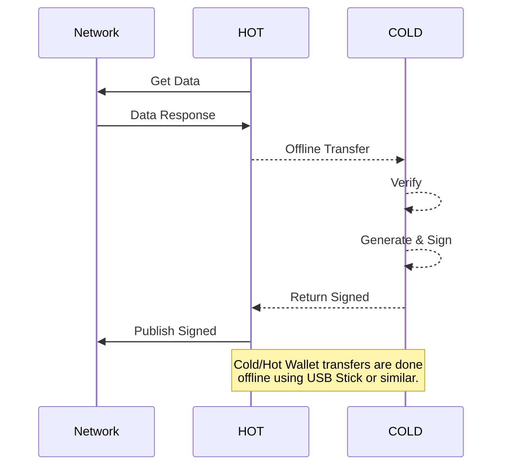

# Integration Guides - Advanced

## Cold Wallets

When security of funds is critical, it is a best practice to split your balance between multiple wallets:

1. One or more **hot wallets** to handle daily user deposits/withdraws.
2. One or more **cold wallets** to securely store Nano in an offline environment.

!!! warning "Important"
	A cold wallet manages private keys that have **never** been on a network-enabled computer.

This guide extends the concepts covered in [External Private Key Management](/integration-guides/key-management/).  It is advised that you read that section before continuing.

!!! note
	Operations done on the hot, online, insecure computer will be prefaced with `(HOT)`. Operations done on the cold, offline, secure computer will be prefaced with `(COLD)`.
	
	Both the hot and cold computers need to have the nano\_node software installed. The hot nano\_node needs to be synced with the network; the cold nano\_node by definition should not be synced as it **never connects to the internet**.

---

!!! info "Cold Wallet Workflow"
	The typical work flow for a cold wallet is as follows:

	1. `(HOT)` Gather account and transaction data.
	1. Transfer this data using an offline method (e.g. via USB stick) to the `(COLD)` secure offline computer.
	1. `(COLD)` Verify Head Block hash.
	1. `(COLD)` Generate and Sign new transaction data.
	1. Transfer the signed transaction back to the `(HOT)` insecure online-computer.
	1. `(HOT)` Publish the signed transaction to the Nano Network.




---

### Private Key Management

The process for external private key management in a cold wallet is very similar to external private key management for a hot wallet. The primary difference is that all signing commands (and thus information containing your private key) are isolated to a clean computer with no network connection.

#### (HOT) Account Information

Get account information by the [`account_info`](/commands/rpc-protocol#account_info) RPC Command:

##### Request Example

```bash
curl -d '{
  "action": "account_info",
  "representative": "true",
  "account": "nano_3qb1qckpady6njewfotrdrcgakrgbfh7ytqfrd9r8txsx7d91b9pu6z1ixrg"
}' http://127.0.0.1:7076
```

##### Success Response

```json
{
  "frontier": "DC8EC06D1F32F97BD69BF59E3297563BD23779F72176A4FF553CFF52309C337E",
  "open_block": "2E1F5AD4BD2C840FD9DC3929ECE9EE6D0B4A8C870E45EDA11048DE91EC409165",
  "representative_block": "DC8EC06D1F32F97BD69BF59E3297563BD23779F72176A4FF553CFF52309C337E",
  "balance": "8900000000000000000000000",
  "modified_timestamp": "1524812177",
  "block_count": "105",
  "representative": "nano_3rropjiqfxpmrrkooej4qtmm1pueu36f9ghinpho4esfdor8785a455d16nf"
}
```

---

#### (HOT) Balance Validation (Part 1)

We should always assume the `(HOT)` computer has been compromised, so cannot trust the balance returned by [`account_info`](/commands/rpc-protocol#account_info). We must obtain the headblock's transaction data and independently confirm the block's hash on our `(COLD)` offline computer. On the `(HOT)` online computer, this information can be obtained by the [`block_info`](/commands/rpc-protocol#block_info) RPC Command.

##### Request Format

```bash
curl -d '{
  "action": "block_info",
  "hash": "{{HEADBLOCK}}"
}' http://127.0.0.1:7076
```

##### Request Example

```bash
curl -d '{
  "action": "block_info",
  "hash": "DC8EC06D1F32F97BD69BF59E3297563BD23779F72176A4FF553CFF52309C337E"
}' http://127.0.0.1:7076
```

###### Success Response

```json
{
    "block_account": "nano_3qb1qckpady6njewfotrdrcgakrgbfh7ytqfrd9r8txsx7d91b9pu6z1ixrg",
    "amount": "100000000000000000000000",
    "balance": "8900000000000000000000000",
    "height": "105",
    "local_timestamp": "0",
    "contents": "{\n
      \"type\": \"state\",\n
      \"account\": \"nano_3qb1qckpady6njewfotrdrcgakrgbfh7ytqfrd9r8txsx7d91b9pu6z1ixrg\",\n
      \"previous\": \"829C33C4E1F41F24F50AB6AF8D0893F484E7078F0FA05F8F56CB69223E8EEE77\",\n
      \"representative\": \"nano_3rropjiqfxpmrrkooej4qtmm1pueu36f9ghinpho4esfdor8785a455d16nf\",\n
      \"balance\": \"8900000000000000000000000\",\n
      \"link\": \"616349D5A5EBA49A73324EF29044B65E13644EC182FFC1ACA4371F897EFF22AA\",\n
      \"link_as_account\": \"nano_1rd5b9ctdtx6mbsm6mqkk34deqimej9e51qzr8pcafrzj7zhyaockuye93sk\",\n
      \"signature\": \"5058A5A1D371CE367D88DB232D398B33DF15FF95D84206986848F4165FFD9FB009B99D9DC6E90D2A3D96C639C7772497C6D6FFB8A67143AE9BB07DC49EB72401\",\n
      \"work\": \"5621a5a58ef8964a\"\n
    }\n"
}
```

!!! info
	Below are a few important points to remember:

	* Contents are returned as a stringified JSON object.
	* The type of the block is `"state"`. This guide only covers on how to trustlessly process `"state"` blocks on an offline computer.

Transfer the response over to the `(COLD)` computer.

---

#### (COLD) Balance Validation (Part 2)

On the `(COLD)` computer, we need to verify the block hash using the [`block_hash`](/commands/rpc-protocol#block_hash) RPC Command.. This allows us to create a safe transaction referencing the reported head block's balance.

##### Request Format

```bash
curl -d '{
  "action": "block_hash",
  "block": "<CONTENTS>"
}' http://127.0.0.1:7076
```

##### Request Example

```bash
curl -d '{
  "action": "block_hash", "block": "{\n
    \"type\": \"state\",\n
    \"account\": \"nano_3qb1qckpady6njewfotrdrcgakrgbfh7ytqfrd9r8txsx7d91b9pu6z1ixrg\",\n
    \"previous\": \"829C33C4E1F41F24F50AB6AF8D0893F484E7078F0FA05F8F56CB69223E8EEE77\",\n
    \"representative\": \"nano_3rropjiqfxpmrrkooej4qtmm1pueu36f9ghinpho4esfdor8785a455d16nf\",\n
    \"balance\": \"8900000000000000000000000\",\n
    \"link\": \"616349D5A5EBA49A73324EF29044B65E13644EC182FFC1ACA4371F897EFF22AA\",\n
    \"link_as_account\": \"nano_1rd5b9ctdtx6mbsm6mqkk34deqimej9e51qzr8pcafrzj7zhyaockuye93sk\",\n
    \"signature\": \"5058A5A1D371CE367D88DB232D398B33DF15FF95D84206986848F4165FFD9FB009B99D9DC6E90D2A3D96C639C7772497C6D6FFB8A67143AE9BB07DC49EB72401\",\n
    \"work\": \"5621a5a58ef8964a\"\n
  }\n"
}' http://127.0.0.1:7076
```

###### Success Response

```json
{ 
  "hash": "DC8EC06D1F32F97BD69BF59E3297563BD23779F72176A4FF553CFF52309C337E"
}
```

Using the responded hash on the `(COLD)` computer guarentees that the transaction we are about to create on the `(COLD)` computer will have a safe, expected outcome.

!!! warning "Important"
	Lets consider the following scenarios where malicious software on the `(HOT)` computer modifies data:

	* You are creating a send transaction.
	* Malicious software alters the `balance` field of the head block to be lower than it actually is in an attempt to get you to send too much Nano to the destination address.
	* This alters the block's hash, but the malicious software could report the honest headblock's hash.

	By independently computing the headblock's hash on the `(COLD)` computer, the generated transaction would be rejected by the network since the `previous` field references a non-existent block which is certainly not the headblock of your account.

Use the responded hash for the `previous` field in your new transaction. When computing final account balance, compute it relative to the `balance` field of the headblock on the `(COLD)` computer. Complete the rest of the [block creation as described in section External Private Key Management](/integration-guides/key-management/#send-transaction).

Once the block is created and signed on the `(COLD)` computer, transfer the contents over to the `(HOT)` computer. From the `(HOT)` computer, run the [`process`](/commands/rpc-protocol#process) RPC command to broadcast the signed transaction to the network.

---

## HTTP callback
Send JSON POST requests with every confirmed block to callback server configured for the node.

--8<-- "multiple-confirmation-notifications.md"

**Configuration**

For details on configuring the HTTP callback within a node, see the [HTTP callback section of Running a Node Configuration](/running-a-node/configuration#http-callback).

**Example Callback**

```json
{  
    "account": "nano_1ipx847tk8o46pwxt5qjdbncjqcbwcc1rrmqnkztrfjy5k7z4imsrata9est",  
    "hash": "B785D56473DE6330AC9A2071F19BD44BCAF1DE5C200A826B4BBCC85E588620FB",  
    "block": "{\n    
             \"type\": \"state\",\n
             \"account\": \"nano_1ipx847tk8o46pwxt5qjdbncjqcbwcc1rrmqnkztrfjy5k7z4imsrata9est\",\n    
             \"previous\": \"82D68AE43E3E04CBBF9ED150999A347C2ABBE74B38D6E506C18DF7B1994E06C2\",\n    
             \"representative\": \"nano_1stofnrxuz3cai7ze75o174bpm7scwj9jn3nxsn8ntzg784jf1gzn1jjdkou\",\n    
             \"balance\": \"5256159500000000000000000000000000000\",\n    
             \"link\": \"8B95FEB05496327471F4729F0B0919E1994F9116FD213F44C76F696B7ECD386A\",\n    
             \"link_as_account\": \"nano_34woztr7b7jkgjrzawnz3e6jmresbyajfzb39x4eguubffzetg5c96f3s16p\",\n    
             \"signature\": \"FBE5CC5491B54FE9CD8C48312A7A6D3945835FD97F4526571E9BED50E407A27ED8FB0E4AA0BF67E2831B8DB32A74E686A62BF4EC162E8FBB6E665196135C050B\",\n    
            \"work\": \"824ca671ce7067ac\"\n    
         }\n",  
    "amount": "2500000000000000000000000000000"  
}
```

Send state blocks have special fields "is_send" & "subtype"   
```json
{  
    "account": "nano_1ipx847tk8o46pwxt5qjdbncjqcbwcc1rrmqnkztrfjy5k7z4imsrata9est",  
    "hash": "82D68AE43E3E04CBBF9ED150999A347C2ABBE74B38D6E506C18DF7B1994E06C2",  
    "block": "{\n    
             \"type\": \"state\",\n
             \"account\": \"nano_1ipx847tk8o46pwxt5qjdbncjqcbwcc1rrmqnkztrfjy5k7z4imsrata9est\",\n    
             \"previous\": \"BE716FE4E21E0DC923ED67543601090A17547474CBA6D6F4B3FD6C113775860F\",\n    
             \"representative\": \"nano_1stofnrxuz3cai7ze75o174bpm7scwj9jn3nxsn8ntzg784jf1gzn1jjdkou\",\n    
             \"balance\": \"5256157000000000000000000000000000000\",\n    
             \"link\": \"5D1AA8A45F8736519D707FCB375976A7F9AF795091021D7E9C7548D6F45DD8D5\",\n    
             \"link_as_account\": \"nano_1qato4k7z3spc8gq1zyd8xeqfbzsoxwo36a45ozbrxcatut7up8ohyardu1z\",\n    
             \"signature\": \"5AF10D3DDD0E3D7A0EF18670560D194C35A519943150650BBBE0CBDB2A47A1E41817DA69112F996A9898E11F1D79EF51C041BD57C1686B81E7F9DFCCFFBAB000\",\n    
            \"work\": \"13ae0ea3e2af9004\"\n    
         }\n",  
    "amount": "90000000000000000000000000000000000",   
    "is_send": "true",  
    "subtype": "send"  
}
```  


!!! warning
    It is recommended to fetch the block using the hash provided in the callback rather than trust this data is valid, and check that data instead, since a malicious 3rd party can also make a fake callback request to your endpoint.

---

## Running Nano as a service

There are 3 different ways to enable RPC for the node:

**In process**

* `rpc.enable` = **true**
* `rpc.child_process.enable` = **false** (default, V19.0+)

**Child process**  
*V19.0+ only*

* `rpc.enable` = **true**
* `rpc.child_process.enable` = **true**
* `rpc.child_process.rpc_path` = [path to nano_rpc]
* `ipc.tcp.enable` = **true**
* `ipc.tcp.port` = `process.ipc_port` of `config-rpc.toml`

**Out of node process**  
*V19.0+ only*

* `rpc.enable` = **false**
* `rpc.child_process.enable` = **false**
* `node.ipc.tcp.enable` = **true**
* `node.ipc.tcp.port` == `process.ipc_port` of `config-rpc.toml`

The choice depends on the setup and security that you want. The easiest way is to use RPC *in_process* according to [configuration](/running-a-node/configuration)

**Launch nano_node in test mode**   

    ./nano_node --daemon --network=test

**Check if RPC is enabled with curl (use different terminal or session)**   

    curl -g -d '{ "action": "block_count" }' '[::1]:7076'

!!! tip
    If you get `curl: (7) Couldn't connect to server`, replace `[::1]:7076` with `127.0.0.1:7076`.

**To stop node, use**   

    curl -g -d '{ "action": "stop" }' '[::1]:7076'

**Launch nano_node as a service with systemd**   

    sudo touch /etc/systemd/system/nano_node.service   
    sudo chmod 664 /etc/systemd/system/nano_node.service   
    sudo nano /etc/systemd/system/nano_node.service   

**Paste your specific user, group, path settings (example)**  
    
    [Unit]
    Description=Nano node service
    After=network.target
    
    [Service]
    ExecStart=/path_to_nano_node/nano_node --daemon
    Restart=on-failure
    User=username
    Group=groupname

    [Install]
    WantedBy=multi-user.target

**Start nano_node service**

    sudo service nano_node start

**Enable at startup**    

    sudo systemctl enable nano_node
    
    
!!! tip
    To manage node, use [RPC commands](/commands/rpc-protocol) or [CLI](/commands/command-line-interface)

### Known issues  

**Error initiating bootstrap ... Too many open files**

Increase max open files limit. Edit `/etc/security/limits.conf` & add    
```
    *               soft    nofile          65535    
    *               hard    nofile          65535    
    root            soft    nofile          65535    
    root            hard    nofile          65535    
```
Then restart session & nano_node service. Check changes with `ulimit -n`
