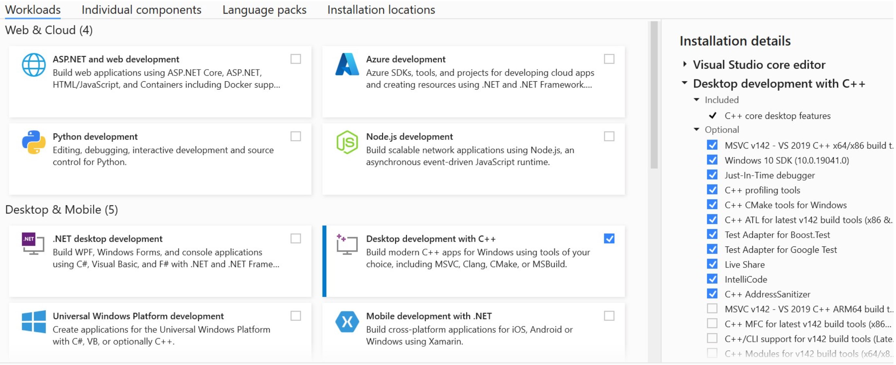
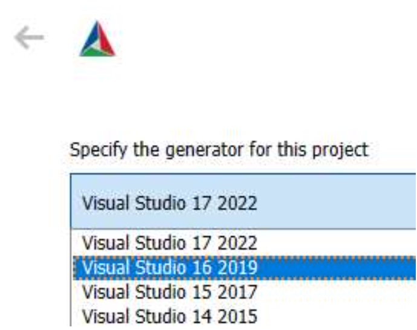
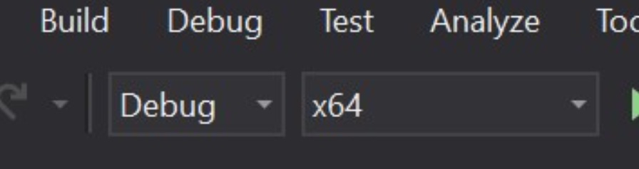
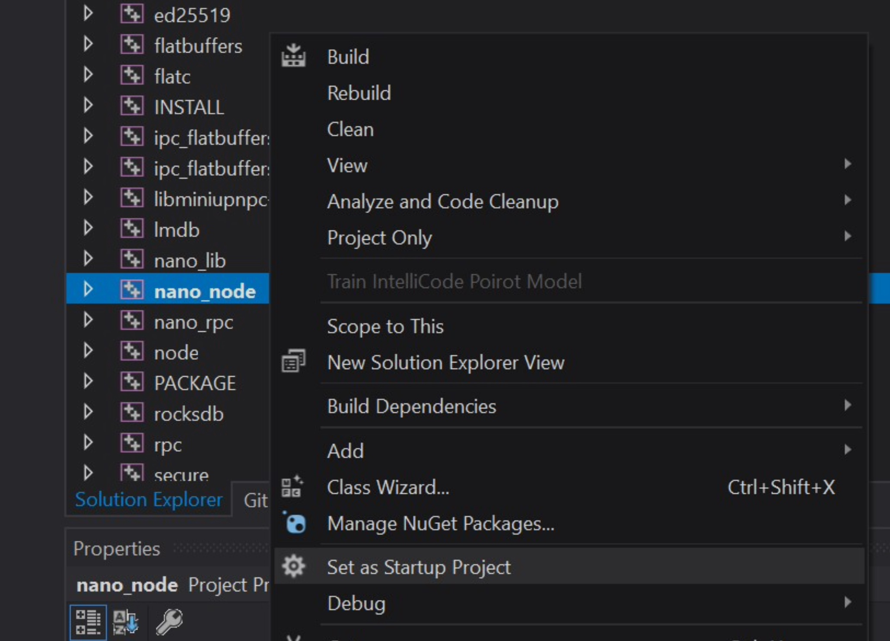
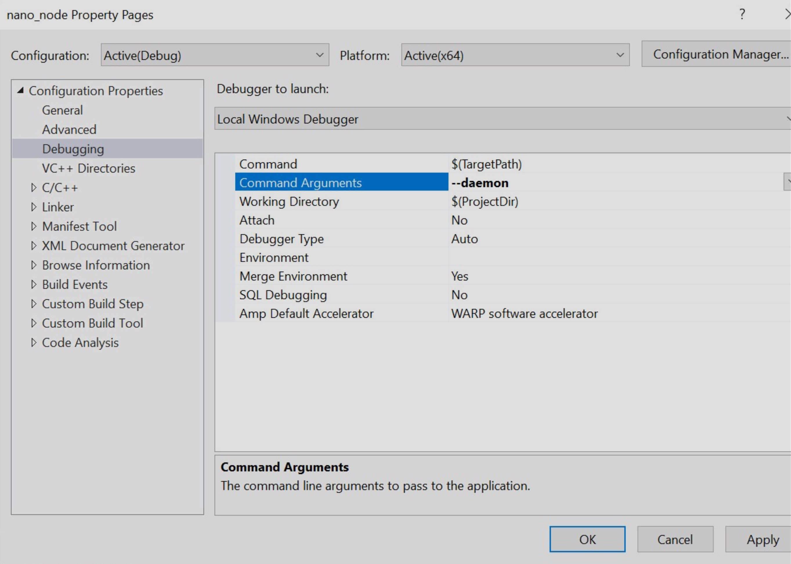

title: Build Options
description: Instructions for manually building the Nano node for a variety of operating systems

# Build Options

--8<-- "warning-only-official-builds-supported.md"

## Official release builds
 
Throughout the development cycle and after releases official builds of the node for Docker, Linux, macOS and Windows are generated and published for test, beta and main networks.

=== "Main network"

    --8<-- "current-build-links-main.md"

=== "Test network"

    --8<-- "current-build-links-test.md"

=== "Beta network"

    --8<-- "current-build-links-beta.md"

## Nano Directory

### Contents

--8<-- "directory-contents.md"

### Locations

=== "Main network"

    --8<-- "directory-locations-main.md"

=== "Test network"

    --8<-- "directory-locations-test.md"

=== "Beta network"

    --8<-- "directory-locations-beta.md"

??? tip "Moving directory locations"
    Some users desire to change the blockchain download location. A solution is available for the no gui nano_node (see https://github.com/nanocurrency/nano-node/issues/79), but no concrete solution is available for the GUI client. However, a workaround can be acheived via the use of symbolic links. Below is a short tutorial for Windows builds:

    1. Rename/delete the Nano directory in your `appdata` Local directory (if you haven't run the wallet yet, skip this step). This is necessary because the command to create a symbolic link in windows will fail if the the input directory already exists.
    1. Decide on where you want to store the blockchain and create a symbolic link. The command is (in an administrative command-prompt): `mklink /d "C:\Users\<user>\AppData\Local\Nano\" "E:\Some\Other\Directory"`. This command creates a symbolic link for a directory (`/d`) that 'redirects' all requests for files/directories in the `Local\Nano` directory to the `Other\Directory`. This means that a file created in the input directory will actually be in the output directory (on the other disk).
    1. Verify it works. Create a file in your Nano directory in your appdata, and you should see it appear in the directory you linked it to (and vice-versa). If you have old wallets or a partially-downloaded blockchain, copy them back into the local directory. Start the wallet.

---

## Requirements & setup

--8<-- "warning-unsupported-configuration.md"

!!! tip "Alternate Windows setup"
    Some users have trouble using the command line approach below for getting setup to build on Windows. An alternative setup is available further down for [Windows 10 & Visual Studio 2019](#windows-10-visual-studio-2019). Variations on these instructions with different versions of Windows, Visual Studio, Cmake, etc. may work as well, but may require adjustments.

### Boost (before V25.0)

If you are building a version before V25.0, the node build commands further down include bootstrapping Boost, but [pre-built binaries](https://sourceforge.net/projects/boost/files/boost-binaries/) can be used for Windows as well, or you can optionally build from the downloaded source instead as follows:

* Download [Boost 1.70+](http://www.boost.org/users/history/version_1_70_0.html)
* Extract to \[boost.src\]
* From inside [boost.src] run:

=== "*nix"
    ```bash
    ./bootstrap.sh --with-libraries=context,coroutine,filesystem,log,program_options,system,thread
    ./b2 --prefix=[boost] --build-dir=[boost.build] link=static install
    ```

=== "macOS"
    ```bash
    ./bootstrap.sh --with-libraries=context,coroutine,filesystem,log,program_options,system,thread
    ./b2 --prefix=[boost] --build-dir=[boost.build] link=static install
    ```

=== "Windows"
    ```bash
    ./bootstrap.sh --with-libraries=context,coroutine,filesystem,log,program_options,system,thread
    ./b2 --prefix=[boost] --build-dir=[boost.build] address-model=64 link=static install
    ```

If using this option, remove `bash util/build_prep/bootstrap_boost.sh -m` from the [build command](#build-commands) below.

### Qt wallet

If building the Qt-based `nano_wallet`, first download [Qt 5.15.2+ open source edition](https://www.qt.io/download) and extract to [qt.src]. In [qt.build] execute:

=== "*nix"
    ```bash
    [qt.src]/configure -shared -opensource -nomake examples -nomake tests -confirm-license  -prefix [qt]
    make
    make install
    ```

=== "macOS"
    ```bash
    [qt.src]/configure -shared -opensource -nomake examples -nomake tests -confirm-license  -prefix [qt]
    make
    make install
    ```

=== "Windows"
    ```bash
    [qt.src]/configure -shared -opensource -nomake examples -nomake tests -confirm-license  -prefix [qt]
    nmake
    nmake install
    ```

### Node

=== "*nix"
    **Required build tools**

    * CMake >= 3.8
    * Clang >= 11 or GCC >= 11.3

    === "Debian"
        **Version**

        * Debian 11 Bullseye (requires Clang 11)

        **Install dependencies**

        ```bash
        sudo apt-get update && sudo apt-get upgrade
        sudo apt-get install git cmake build-essential libc++-dev libc++abi-dev clang clang++11 curl wget
        sudo apt-get install qtbase5-dev qtchooser qt5-qmake qtbase5-dev-tools
        ```
    
        **Qt wallet dependencies**

        ```bash
        sudo apt-get install qtbase5-dev qtchooser qt5-qmake qtbase5-dev-tools
        ```

        **Before build**

        ```bash
        export CC=/usr/bin/clang-11
        export CXX=/usr/bin/clang++-11
        cmake ...
        ```

    === "Ubuntu"
        **Version**
        
        * Ubuntu 22.04 LTS Server
        * Ubuntu 22.10+

        **Install dependencies**

        ```bash
        sudo apt-get update && sudo apt-get upgrade
        sudo apt-get install git cmake g++ curl wget
        ```

        **Qt wallet dependencies**

        ```bash
        sudo apt-get install qtbase5-dev qtchooser qt5-qmake qtbase5-dev-tools
        ```

    === "Rocky Linux"
        **Version**
        
        * Rocky Linux 8

        **Install dependencies**

        ```bash
        sudo yum check-update
        sudo yum install git curl wget cmake
        ```

        **Configure repository with modern GCC**
        ```bash
        sudo yum install gcc-toolset-12
        scl enable gcc-toolset-12 bash
        ```

    === "Arch Linux"

        **Install dependencies**

        ```bash
        pacman -Syu
        pacman -S base-devel git gcc cmake curl wget
        ```

=== "macOS"
    **Required build tools**
    
    * CMake >= 3.8
    * XCode >= 13.1

=== "Windows"
    **Required build tools**

    * CMake >= 3.8
    * NSIS package builder
    * [Visual Studio 2019 Community](https://my.visualstudio.com/Downloads?q=visual%20studio%202019&wt.mc_id=o~msft~vscom~older-downloads) (or higher edition, if you have a valid license. eg. Professional or Enterprise)
        * Select **Desktop development with C++**
        * Select the latest Windows 10 SDK

---

## Build commands

### Node

The process below will create a release build of the node for the main network. See [network options](#network-options) below for details on building for the test or beta networks.

=== "*nix"
    ```bash
    git clone --branch V25.0 --recursive https://github.com/nanocurrency/nano-node.git nano_build
    cd nano_build
    # Boost is not required for building V25.0 or earlier versions
    # export BOOST_ROOT=`pwd`/../boost_build
    # bash util/build_prep/bootstrap_boost.sh -m
    cmake -G "Unix Makefiles" .
    make nano_node
    cp nano_node ../nano_node && cd .. && ./nano_node --diagnostics
    ```

=== "macOS"
    ```bash
    git clone --branch V25.0 --recursive https://github.com/nanocurrency/nano-node.git nano_build
    cd nano_build
    # Boost is not required for building V25.0 or earlier versions
    # export BOOST_ROOT=`pwd`/../boost_build
    # bash util/build_prep/bootstrap_boost.sh -m
    cmake -G "Unix Makefiles" .
    make nano_node
    cp nano_node ../nano_node && cd .. && ./nano_node --diagnostics
    ```

=== "Windows"

    **Setup**

    *Download Source*

    Using git_bash:
    ```bash
    git clone --branch V25.0 --recursive https://github.com/nanocurrency/nano-node
    cd nano-node
    ```

    *Create a `build` directory inside nano-node (makes for easier cleaning of build)*

    Using git_bash:
    ```bash
    mkdir build
    cd build
    ``` 
    * **Note:** all subsequent commands should be run within this "build" directory.

    *Get redistributables*

    Using Powershell:
    ```bash
    Invoke-WebRequest -Uri https://aka.ms/vs/16/release/vc_redist.x64.exe -OutFile .\vc_redist.x64.exe
    ```

    *Generate the build configuration.*

    Using 64 Native Tools Command Prompt:

    * Ensure the Qt, Boost (if < V25.0), and Windows SDK paths match your installation.

    ```bash
    cmake -DNANO_GUI=ON -DQt5_DIR="C:\Qt\5.15.2\msvc2019_64\lib\cmake\Qt5" -DNANO_SIMD_OPTIMIZATIONS=TRUE -DBoost_COMPILER="-vc141" -DBOOST_ROOT="C:/local/boost_1_70_0" -DBOOST_LIBRARYDIR="C:/local/boost_1_70_0/lib64-msvc-14.1" -G "Visual Studio 16 2019" -DIPHLPAPI_LIBRARY="C:/Program Files (x86)/Windows Kits/10/Lib/10.0.19041.0/um/x64/iphlpapi.lib" -DWINSOCK2_LIBRARY="C:/Program Files (x86)/Windows Kits/10/Lib/10.0.19041.0/um/x64/WS2_32.lib" ..\.
    ```
    
    * If you are building V25.0 or any earlier version, you do not need to specify the Boost library.

    ```bash
    cmake -DNANO_GUI=ON -DQt5_DIR="C:\Qt\5.15.2\msvc2019_64\lib\cmake\Qt5" -DNANO_SIMD_OPTIMIZATIONS=TRUE -G "Visual Studio 16 2019" -DIPHLPAPI_LIBRARY="C:/Program Files (x86)/Windows Kits/10/Lib/10.0.19041.0/um/x64/iphlpapi.lib" -DWINSOCK2_LIBRARY="C:/Program Files (x86)/Windows Kits/10/Lib/10.0.19041.0/um/x64/WS2_32.lib" ..\.
    ```

    **Build**
    	
    * Open `nano-node.sln` in Visual Studio
    * Build the configuration specified in the previous step
    * Alternative using 64 Native Tools Command Prompt:

    ```bash 
    cmake --build . --target ALL_BUILD --config %CONFIGURATION% -- /m:%NUMBER_OF_PROCESSORS%
    ```

    **Package up binaries**

    Using 64 Native Tools Command Prompt:

    * Replace **%CONFIGURATION%** with the build configuration specified in previous step
    * Replace **%GENERATOR%** with NSIS (if installed) or ZIP

    ```bash 
    cpack -G %GENERATOR% -C %CONFIGURATION%
    ```

### Qt wallet

This is only required when the Qt wallet with GUI is needed.

`make nano_wallet`

### RPC server

This is only required for when the RPC server is being [run as a child process or outside the node process completely](advanced.md#running-nano-as-a-service).

`make nano_rpc`

---

## Windows 10 & Visual Studio 2019

An alternative node building process for Windows 10 using Visual Studio 2019 can be found below. As this uses GUI options, some of the steps and images may vary if using versions other than those indicated.

**Windows updates**

Ensure Windows 10 is running and the latest updates have been completed, restart Windows.

**Visual Studio 2019**

Install Visual Studio Community 2019 (version 16.11) https://visualstudio.microsoft.com/vs/older-downloads/. Make sure to tick `Desktop development with C++` and leave everything else at default.



**Boost** (before V25.0)

Install Boost 1.74.0 binaries for msvc 14.2. Use default settings during install
https://sourceforge.net/projects/boost/files/boost-binaries/1.74.0/boost_1_74_0-msvc-14.2-64.exe/download

**CMake**

Install Cmake windows installer, Latest Release
https://cmake.org/download/.

Check the option `Add cmake to system path for all users`

**Git**
Download a git tool of choice such as Github desktop https://desktop.github.com/. Clone the nano node develop branch from Github
from URL https://github.com/nanocurrency/nano-node to your preferred path, such as: `C:\Users\YourUser\Documents\GitHub\nano-node`.

**Restart Windows**

**Setting up the solution**

Run CMake GUI

- Set `Where is the source code` to your preferred path: `C:\Users\YourUser\Documents\GitHub\nano-node`
- Create a directory for the destination files such as: `C:\Users\YourUser\Documents\NanoSolution` and set in `Where to build the binaries`
- Click `Configure` and select `Visual Studio 16 2019` as the generator for the project
- Set any necessary [CMake variables](#cmake-variables) you need, such as the `ACTIVE_NETWORK` but leave `NANO_GUI` off because this requires QT to be installed
- Click `Generate` and close Cmake




**Visual studio 2019**

- Open project solution file in `C:/Users\YourUser\Documents\NanoSolution\nano-node-beta.sln`
- At the top of the screen select the build type (`Debug` or `Release`) and architecture (`x64`)



- Go to the build menu and select `Build`
- When build has finished you will find the compiled files at `C:/Users\YourUser\Documents\NanoBinaries\Debug` or `C:/Users\YourUser\Documents\NanoBinaries\Release` 

**Optional: Setup debugging**

You can setup the node to stop at code breakpoints and then inspect values during runtime.

Find the nano_node project in the solution explorer on the right pane. Then right click it and select `Set as startup project`



Right click the nano_node project again and click `Properties`
Go to `Configuration Properties` > `Debugging` and set the `Command Arguments` to `--daemon`, click OK



From Visual Studio hit `F5` to start debugging. When a breakpoint is hit, Visual Studio will halt the code and take focus.

---

## Additional build details

### Node

#### CMake variables

Format: `cmake -D VARNAME=VARVALUE`

* `BOOST_ROOT=\[boost\]` (`/usr/local/boost/` if bootstrapped)
* `CMAKE_BUILD_TYPE=Release` (default)
* `ACTIVE_NETWORK=nano_live_network` (default)
* `Qt5_DIR=[qt]lib/cmake/Qt5` (to build GUI wallet)
* `NANO_GUI=ON` (to build GUI wallet)
* `ENABLE_AVX2=ON`, *optional* `PERMUTE_WITH_GATHER=ON`, *optional* `PERMUTE_WITH_SHUFFLES=ON` (for CPU with AXV2 support, choose fastest method for your CPU with https://github.com/sneves/blake2-avx2/)
* `CRYPTOPP_CUSTOM=ON` (more conservative building of Crypto++ for wider range of systems)
* `NANO_SIMD_OPTIMIZATIONS=OFF` (Enable CPU-specific SIMD optimization: SSE/AVX or NEON, e.g.)
* `NANO_SECURE_RPC=ON` (to build node with TLS)
* `NANO_WARN_TO_ERR=ON` (*v20.0+* turn compiler warnings into errors on Linux/Mac) 
* `NANO_TIMED_LOCKS=50` (*v20.0+* when the number of milliseconds a mutex is held is equal or greater than this output a stacktrace, 0 disables.)
* `NANO_STACKTRACE_BACKTRACE=ON` (*v20.0+* use a different configuration of Boost backtrace in stacktraces, attempting to display filenames, function names and line numbers. Needs `libbacktrace` to be installed. Some [workarounds](https://www.boost.org/doc/libs/develop/doc/html/stacktrace/configuration_and_build.html#stacktrace.configuration_and_build.f3) may be necessary depending on system and configuration. Use CLI [`--debug_stacktrace`](/commands/command-line-interface#-debug_stacktrace) to get an example output.)
* `CI_BUILD=TRUE` (*v20.0+* if enabled, uses environment variable `TRAVIS_TAG` (required) to modify the locally reported node version; example `TRAVIS_TAG="My Nano Node v20"`)
* `NANO_ASIO_HANDLER_TRACKING=10` (Output asio diagnostics for any completion handlers which have taken longer than this in milliseconds. For more information see the description of the PR [#2681](https://github.com/nanocurrency/nano-node/pull/2681))
* `NANO_FUZZER_TEST=ON` (Build the fuzz tests, not available on Windows)

#### Building a package

=== "*nix"
    `cpack -G "TBZ2"`

=== "macOS"
    `cpack -G "DragNDrop"`

=== "Windows"
    `cpack -G "NSIS"`

#### Network options

**Main network**

The default build network is the main network. No option needs to be specified.

**Test Network**

* To run a node on the test network, set CMake variable: `-DACTIVE_NETWORK=nano_test_network`
* More information can be found on the [Test Network page](../running-a-node/test-network.md)

**Beta Network**

* To run a node on the beta network, set CMake variable: `-DACTIVE_NETWORK=nano_beta_network`
* More information can be found on the [Beta Network page](../running-a-node/beta-network.md)

## Testing

A number of tests binaries can be built when the CMake variable `-DNANO_TEST=ON`. With this variable set, `make` will also build test files, and will produce `core_test`, `rpc_test`, `load_test` and `slow_test` binaries, which can be executed:

* `core_test` - Tests the majority of protocol, node and network functionality.
* `slow_test` - Tests which operate on a large amount of data and may take a while. Not currently tested by CI.
* `rpc_test` - Tests all RPC commands
* `load_test` - Launches many nodes and RPC servers, checking sending/receiving blocks with simultaneous calls. Use `./load_test --help` to see the available options

### Running Tests

To run all tests in a binary just launch it:
```bash
./core_test
```

To check a specific subset of tests, gtest filtering can be used (with optional wildcards):
```bash
./core_test --gtest_filter=confirmation_height.single
./rpc_test --gtest_filter=rpc.*
```

To run tests multiple times:
```bash
./core_test --gtest_repeat=10
```

If running on a debugger, add the argument `--gtest_break_on_failure` break at the moment a test fails.

### Environment variables to customize tests

* `TEST_KEEP_TMPDIRS=1` - Setting this to anything will prevent the tests deleting any files it creates, useful for debugging log files. 
* `TEST_USE_ROCKSDB=1` - Use the RocksDB ledger backend for the tests instead of LMDB. The tests must be built with [RocksDB](/running-a-node/rocksdb-ledger-backend/#rocksdb-ledger-backend) support.
* `TEST_BASE_PORT=26000` - The base port used in tests, the range of ports used in this case would be 26000 - 26199. This is useful if wanting to run multiple tests at once without port conflicts, the default base port used is 24000. 
* `NANO_DEFAULT_PEER=peering.nano.org` - Setting this adds its variable contents to `preconfigured_peers` from config-node.toml, & allows manually setting initial peering DNS. Setting it to an unresolvable address will prevent the node from contacting peers (after wiping peer table).

### Sanitizers

3 different CMake sanitizer options are supported: `NANO_ASAN_INT`, `NANO_TSAN` and `NANO_ASAN`. They cannot be used in conjunction with each other.

#### Thread Sanitizer
Use `-DNANO_TSAN=ON` as an extra CMake option. The following environment variable should also be set:

`export TSAN_OPTIONS="suppressions=../tsan_suppressions"`

`tsan_suppressions` should be a path to the file in the root nano directory. This suppresses many errors relating to the mdb and rocksdb libraries.

#### Address Sanitizer
Use the CMake variable `-DNANO_ASAN=ON` or `-DNANO_ASAN_INT=ON` before running an executable.

### Valgrind

Valgrind can be used to find other issues such as memory leaks. A valgrind suppressions file is provided to remove some warnings. Valgrind can be run as follows (there are many options available):

```bash
valgrind --leak-check=full --track-origins=yes --suppressions=../valgrind.supp ./core_test
```
