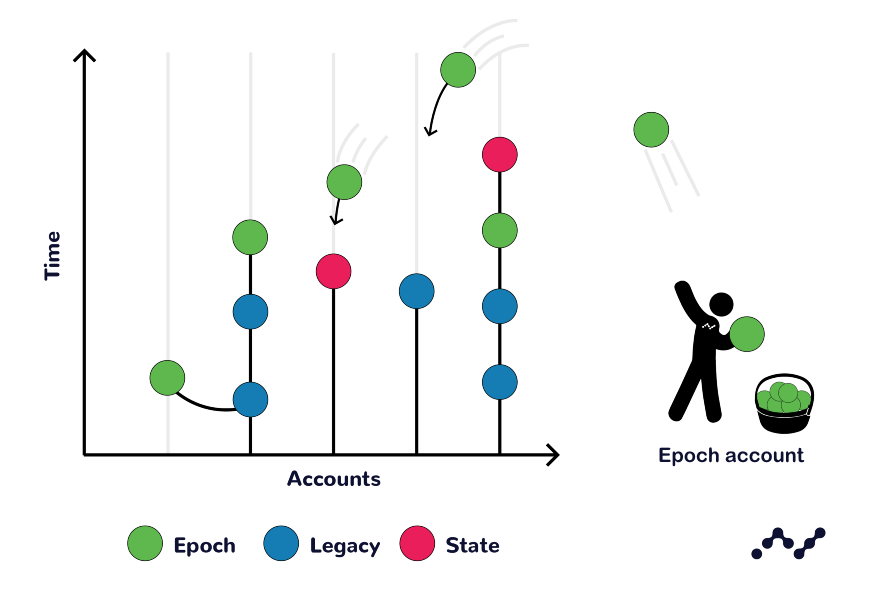

title: Protocol Design - Blocks
description: Tour the unique design and structure of blocks in the Nano protocol

# Protocol Design - Blocks

--8<-- "wip-living-whitepaper.md"

!!! info "Key terms in this section"
	--8<-- "terms-block-transaction-transfer.md"

## State Blocks

All new transactions on the Nano Protocol are communicated via blocks. The account's entire state, including the balance after each transaction, is recorded in every block. Transaction amounts are interpreted as the difference in balance between consecutive blocks.

| Key            | RPC Format          | Serialized | Description |
|                |                     |            |             |
| type           | string              | -          | "state" |
| account        | string              | 32 bytes   | This account's nano_ address |
| previous       | 64 hex-char string  | 32 bytes   | Previous head block on account; 0 if *open* block |
| representative | string              | 32 bytes   | Representative nano_ address |
| balance        | decimal string      | 16 bytes   | Resulting balance (in [raw](#units)) |
| link           | -                   | 32 bytes   | Multipurpose field - see link table below |
| signature      | 128 hex-char string | 64 bytes   | ED25519+Blake2b 512-bit signature |
| work           | 16 hex-char string  | 8 bytes    | [Proof of Work](../glossary.md#proof-of-work-pow) Nonce |

Depending on the action each transaction intends to perform, the `"link"` field will have a different value for [block_create](/commands/rpc-protocol#block_create) RPC command:

| Action  | RPC Format         | Description                                |
|         |                    |                                            |
| Change  | string             | Must be "0"                                |
| Send    | string             | Destination "nano_" address                |
| Receive | 64 hex-char string | Pairing block's hash (block sending funds) |


An example of a Nano block:
```
"block": {
  "type": "state",
  "account": "nano_3qgmh14nwztqw4wmcdzy4xpqeejey68chx6nciczwn9abji7ihhum9qtpmdr",
  "previous": "F47B23107E5F34B2CE06F562B5C435DF72A533251CB414C51B2B62A8F63A00E4",
  "representative": "nano_1hza3f7wiiqa7ig3jczyxj5yo86yegcmqk3criaz838j91sxcckpfhbhhra1",
  "balance": "1000000000000000000000",
  "link": "19D3D919475DEED4696B5D13018151D1AF88B2BD3BCFF048B45031C1F36D1858",
  "link_as_account": "nano_18gmu6engqhgtjnppqam181o5nfhj4sdtgyhy36dan3jr9spt84rzwmktafc",
  "signature": "3BFBA64A775550E6D49DF1EB8EEC2136DCD74F090E2ED658FBD9E80F17CB1C9F9F7BDE2B93D95558EC2F277FFF15FD11E6E2162A1714731B743D1E941FA4560A",
  "work": "cab7404f0b5449d0"
}
```
Note that there is an open [proposal](https://github.com/nanocurrency/nano-node/issues/2864) to update the state block with version, block height, and subtype fields.

### Account balance

If an account balance decreases, the transaction that caused the decrease is considered a send. Similarly, if an account balance increases, the transaction that caused the increase is considered a receive.

### Block vs. transaction

In traditional blockchain-based cryptocurrencies like Bitcoin, a block is a group of transactions. In Nano, a block is a single transaction, so the term “block” and “transaction” are often used interchangeably. "Transaction" specifically refers to the action, while block refers to the digital encoding of the transaction. Transactions are signed by the private-key belonging to the account on which the transaction is performed. 

---

## Creating transactions

### Open

To create an account, an open transaction must be issued first. This is always the first transaction (block 0) of every account-chain and can be created upon the first receipt of funds. To open an account, you must have sent some funds to it with a send transaction from another account. The funds will be pending on the receiving account. The account field stores the public-key (address) derived from the private-key that is used for signing. The link field contains the hash of the transaction that sent the funds. On account creation, a representative must be chosen to vote on your behalf; this can be changed later. The account can declare itself as its own representative. 


### Send

A send transaction is one that decreases the sender's account balance by the amount they intend to send. To send from an address, the address must already have an existing open block, and therefore a balance. The previous field contains the hash of the previous block in the account-chain. The link field contains the account for funds to be sent to. A send block is immutable once confirmed. Once broadcasted to the network, funds are immediately deducted from the balance of the sender's account and wait as pending until the receiving party signs a block to accept these funds. Pending funds should not be considered awaiting confirmation, as they are as good as spent from the senders account and the sender cannot revoke the transaction.

### Receive

A receive block is very similar to the send block mentioned above, except the account balance is increasing and the link field contains the send block's hash. To complete a transaction, the recipient of sent funds must create a receive block on their own account-chain. The source field references the hash of the associated send transaction. Once this block is created and broadcasted, the account's balance is updated and the funds have officially moved into their account.

### Change rep

Nano account holders have the ability to choose a representative to vote on their behalf. This can be done any time (i.e. in an open, send, or receive transaction) by changing the representative field. In conventional PoS systems, the account owner’s node must be running to participate in voting. Continuously running a node is impractical for many users; giving a representative the power to vote on an account’s behalf relaxes this requirement. A change transaction changes the representative of an account by subtracting the vote weight from the old representative and adding the weight to the new representative. No funds are moved in this transaction, and the representative does not have spending power of the account’s funds.

---

## Epoch blocks

Since all accounts on the Nano network are asynchronous, an asynchronous form of chain upgrades is needed. Unlike Bitcoin, Nano is not able to say “upgrade at block X”, so Epoch blocks were developed as a solution to this problem. 

Epoch blocks are a special block type that can only be generated using a pre-determined private key. These will be accepted by nodes and be attached as the frontier blocks on each account-chain on the network. This feature was built to allow very limited controls using these blocks: they cannot change account balances or representatives, only upgrade the account versions to allow new block structures. Furthermore, if the majority of the network does not upgrade to a new node version that enables a particular epoch block, then the epoch block will have minimal or no effect. 



As an account-chain upgrade, Epoch blocks move accounts on the network from Epoch X to Epoch X+1. Any future transactions from an upgraded account will have a minimum version of X+1, which cannot be received by previous node versions.

Epoch blocks are unable to change any balances or representatives on accounts. If an epoch block did attempt to change the balance of an account, the node would reject it because the signature would be incorrect, as only the account-chain holder can sign blocks which change balances or representatives.

---

Existing whitepaper sections related to this page:

* [Nano Components](/whitepaper/english/#raiblocks-components)
* [System Overview](/whitepaper/english/#system-overview)

Existing content:

* [Athena and Epoch v2 Blocks Explained](https://medium.com/nanocurrency/athena-and-epoch-v2-blocks-explained-de0a3dd37c39)
* [Blocks specifications](/the-basics/#blocks-specifications)
* [Creating transactions](/key-management/#creating-transactions)
* [Nano 101: Epoch Blocks](https://medium.com/nanocurrency/an-epoch-blocks-explainer-aa22905b28db)
* [Nano How 2: Blocks and Lattices](https://medium.com/nano-education/nano-how-2-blocks-and-lattices-c0ccd417bd5a)
* [Network Upgrades details on epoch blocks](../releases/network-upgrades.md#epoch-blocks)
