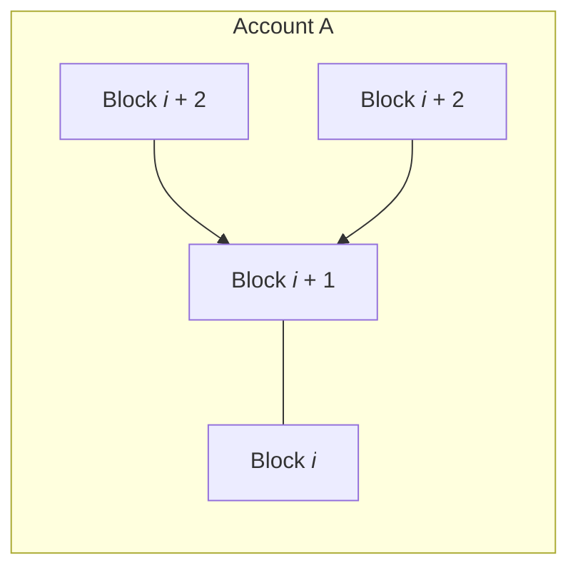

title: Protocol Design - ORV Consensus
description: Take a deep dive into the unique, gossip-based algorithm used by Nano to generate global consensus across all nodes on the network

# Protocol Design - ORV Consensus

--8<-- "wip-living-whitepaper.md"

## Overview

In order to protect against [double spending](attack-vectors.md/#50-attack) and [Sybil attacks](attack-vectors.md/#sybil-attack-to-change-ledger-entries), Nano uses a unique consensus mechanism called Open Representative Voting (ORV). In ORV, user-selected representative nodes vote on each transaction, and every node (representative or not) independently [cements](../glossary.md#cementing) each transaction after seeing enough representative votes to achieve [quorum](#quorum). Since Nano transactions are processed individually and asynchronously, deterministic finality (irreversible, full-settlement) is achieved in a short period of time, typically less than 1 second [^1]. Due to Nano's [block-lattice ledger design](ledger.md), only account owners have the ability to sign blocks into their accountchains, so all forks must be the result of poor programming or malicious intent (double-spend) by the account owner, which means that nodes can easily make policy decisions on how to handle forks without affecting legitimate transactions.

### Open Representative Voting (ORV) vs Proof of Stake (PoS)

While Nano uses a weighted-voting system ([ORV](/protocol-design#orv-consensus)) that can be compared to PoS, it differs from traditional PoS because:

- There is not one monolithic blockchain that requires leader selection (i.e. a staker or a miner) to extend

- Representatives do not create or produce shared blocks (groups of transactions)

- Each Nano account has its own blockchain that only the owner can modify (representatives can only modify their own blockchain)

- In Nano, a block is a single transaction (not a group of transactions). Transactions are evaluated individually and asynchronously

- Users can remotely re-delegate their voting weight to anyone at any time

- Anyone can be a representative

- No funds are staked or locked up

- Representatives do not earn transaction fees

- Representatives cannot reverse transactions that nodes have locally confirmed (due to [block cementing](/glossary#cementing)).

### Explaining Nano's confirmation speed

A Bitcoin block is a group of transactions (~1 Megabyte per block) that has to be propagated and processed together, while a [Nano block](blocks.md) is a single transaction (~200 bytes) that is almost 5000 times smaller than a Bitcoin block. Even with on disk database overhead, a Nano block (transaction) is ~600 bytes. As a Nano sender, you publish a block to all the Nano [principal representatives (PRs)](#principal-representatives-vs-non-principal-representatives) [^2] at the speed of internet latency (20-100ms typically, depending on location), and those PRs then generate their vote (another very small network packet) and publish it to each other (all PR nodes), plus a subset of non-PR peers, who then publish to a subset of their peers (gossip-about-gossip). Once your node sees enough vote responses to cross its local vote weight threshold for confirmation (>50% of online vote weight by default), it considers the transaction to be confirmed and cements it as irreversible.

### Principal Representatives vs Non-Principal Representatives

There are two types of representatives in Nano: principal (PR) and non-principal. To become a principal representative (PR), a Nano account must have at least 0.1% of [online voting weight](../glossary/#online-voting-weight) delegated to it, but the only operational difference between the two representative types is that PR votes are rebroadcasted by other nodes who receive the votes, helping the network reach consensus more quickly. This implementation decision was made in part because of the exponential bandwidth cost of allowing every Nano node (potentially thousands) to send a vote to every other Nano node, when the vast majority of nodes would not be able to meaningfully contribute to consensus since their delegated vote weight might only be a millionth of a percent while >50% online vote weight is required for a transaction to achieve confirmation.

---

## Incentives for participating in consensus
[Incentives to run a node](https://medium.com/nanocurrency/the-incentives-to-run-a-node-ccc3510c2562)

---

## Block validation

---

## Voting

### Vote contents

### Vote-by-hash

---

## Fork handling

A fork occurs when j signed blocks b1, b2, . . . , bj claim the same block as their predecessor. 

These blocks cause a conflicting view on the status of an account and must be resolved. Only the account's owner has the ability to sign blocks into their account-chain, so a fork must be the result of poor programming or malicious intent (double-spend) by the account's owner. 

Upon detection, a representative will create a vote referencing the block $\hat{b}_i$ in its ledger and broadcast it to the network. The weight of a node's vote, $w_i$, is the sum of the balances of all accounts that have named it as its representative. The node will observe incoming votes from the other $M$ online representatives and keep a cumulative tally for 4 voting periods, 1 minute total, and confirm the winning block. 

$$\begin{aligned}
   v(b_j) &= \sum_{i=1}^M w_i{1}_{\hat{b}_i=b_j} \label{eq:weighted_vote} \\
   b^* &= \mathop{\mathrm{arg\,max}}_{b_j} v(b_j) \label{eq:most_votes}\end{aligned}$$

The most popular block $b^*$ will have the majority of the votes and will be retained in the node's ledger. The block(s) that lose the vote are discarded. If a representative replaces a block in its ledger, it will create a new vote with a higher sequence number and broadcast the new vote to the network. This is the **only** scenario where representatives vote. 

In some circumstances, brief network connectivity issues may cause a broadcasted block to not be accepted by all peers. Any subsequent block on this account will be ignored as invalid by peers that did not see the initial broadcast. A rebroadcast of this block will be accepted by the remaining peers and subsequent blocks will be retrieved automatically. Even when a fork or missing block occurs, only the accounts referenced in the transaction are affected; the rest of the network proceeds with processing transactions for all other accounts.

### Fork resolution

#### Simple

#### Complex

### Why PoW for receive blocks

---

## Quorum

## References

[^1]: "Block Confirmation Times", 2020. [Online]. Available: https://repnode.org/network/confirmation 
[^2]: Srayman, "Community Blog: Proposal for Nano Node Network Optimizations", 2020. [Online]. Available: https://medium.com/nanocurrency/proposal-for-nano-node-network-optimizations-21003e79cdba

---

Existing whitepaper sections related to this page:

* [System Overview](/whitepaper/english/#system-overview)
* [Implementation](/whitepaper/english/#implementation)

Existing content related to this page:

* [Representatives and voting](/what-is-nano/overview/#representatives-and-voting)
* [Representatives](/integration-guides/the-basics/#representatives)
* [PoW for Receive block](https://github.com/nanocurrency/nano-node/issues/464#issuecomment-356467448)
