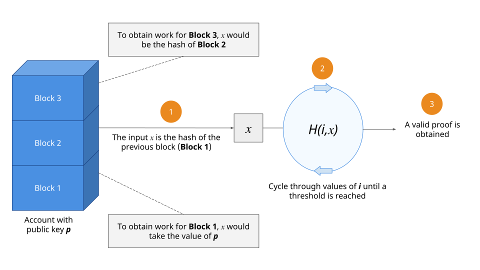
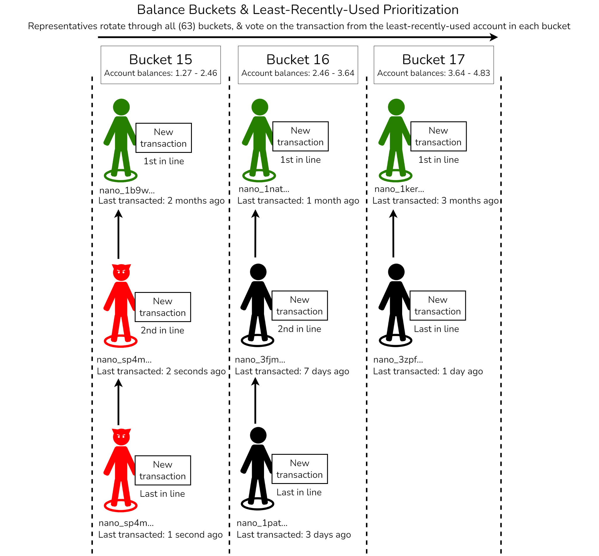

title: Protocol Design - Spam, Work, & Prioritization
description: Learn how Nano fights spam using balance-bucket transaction prioritization & proof-of-work

# Protocol Design - Spam, Work, & Prioritization

--8<-- "wip-living-whitepaper.md"

## Spam resistance

A spam transaction is loosely defined as a block broadcasted with the intent to saturate the network, reduce network availability, or increase the size of the ledger. In order to make spam more costly, each valid block in Nano requires a proof-of-work (PoW) solution to be attached to it - similar to the original Hashcash proposition[^1]. Participants can compute the required work in a few seconds, and verification time for this work is negligible (to prevent invalid blocks, large work, and/or invalid work from becoming a denial-of-service attack vector). The cost of spamming the network then increases linearly with the number of spam transactions, reducing the impact of spam from theoretically infinite to a manageable amount.

In addition to proof-of-work, another key component of Nano's defense against spam is transaction prioritization using a round-robin balance-bucket system, combined with least-recently-used (LRU) prioritization within those buckets. This system ensures that spam does not prevent legitimate users from making transactions & achieving fast confirmation, which in turn removes some of the incentives to spam (e.g. network disruption). See the [prioritization details](#prioritization-details) & [prioritization buckets](#prioritization-buckets) sections below for more information. While prioritization can be considered a "Node Implementation" topic, it's included in this "Protocol Design" discussion due to its relevance to spam resistance.

## Spam resistance features

| **Feature** | **Description** | **Version** |
| - | - | - |
| Ascended bootstrapping limits via: requests_limit, database_requests_limit, pull_count, timeout | - | V25+ |
| bandwidth_limit | - | - |
| Balance buckets | - | - |
| Bootstrap_bandwidth_limit | - | V25+ |
| bootstrap_connections_max | - | <V25 |
| Bounded active election buckets | Allows for dynamically dropping and scheduling higher priority elections, and buckets can be configured to opportunistically use more available space if AEC is underutilized | V27+ |
| [Fair queueing for block processor](https://github.com/nanocurrency/nano-node/pull/4476) | - | V27+ |
| [Fair queueing for vote processor](https://github.com/nanocurrency/nano-node/pull/4536) | - | V27+ |
| [Fair queueing for bootstrap server](https://github.com/nanocurrency/nano-node/pull/4584) | - | V27+ |
| [Fair queueing for request aggregator](https://github.com/nanocurrency/nano-node/pull/4598) | - | V27+ |
| [Final vote replies](https://github.com/nanocurrency/nano-node/pull/4648) | - | V27+ |
| Hinted elections | A percentage of election slots are reserved for hinted elections, meaning that nodes start elections for transactions with a high vote weight, regardless of individual node priority. This allows the network to progress forward on confirmations, keeping the network in sync. | - |
| Hinted elections for dependencies | - | V26+ |
| [is_originator flag](https://github.com/nanocurrency/nano-node/pull/4654) | Helps ensure original blocks get priority over republished blocks | V27+ |
| Lazy bootstrapping  | Similar to optimistic elections, but for bootstrapping | - |
| Least-Recently Used (LRU) Prioritization | - | - |
| [Local block broadcaster](https://github.com/nanocurrency/nano-node/pull/4454) | Only rebroadcast blocks during active elections. Move initial block gossip responsibility to the block originator | V27+ |
| Multi-threaded vote processor & request aggregator | Greatly improves vote processing & signature verification | V27+ |
| Optimistic elections | If a more recent block is confirmed, all of its dependencies are also confirmed | - |
| Proof-of-Work | Each Nano transaction requires a small Proof-of-Work | All
| [Rep crawler overhaul](https://github.com/nanocurrency/nano-node/pull/4449#issuecomment-1968919321) | Consistently find representatives, even when vote requests are unreliable | V27+ |
| Vote by hash | Increased to 255 hashes/vote in V27 | V27+ |
| Bounded unchecked memory table | - | - |
| Unchecked table limited to two items per dependency | - | - |
| Check for correct message formats via message_deserializer (valid work, valid header, valid message type, valid version, valid network bytes (magic bytes), etc) | - | - |
| Don't requeue blocks with invalid signatures | - | - |
| (Future) See list of [potential performance improvements]([url](https://github.com/nanocurrency/nano-node/issues/4262)) | - | Future |
  
## Work algorithm details

Every [block](../blocks) includes a work field that must be correctly populated. Valid work is obtained by randomly guessing a nonce such that:

$$
H(\text{nonce} || \text{x}) \ge \text{threshold}
$$

where $H$ is an algorithm, usually in the form of a hash function, $||$ is the concatenation operator, $threshold$ is a parameter of the network that relates to the resources spent to obtain a valid work, and $x$ is either:

- The account's public key, in the case of the first block on the account, or
- The previous block's hash

The following image illustrates the process by which valid work is obtained for **Block 2**.

The work field is not used when signing a block. This design has two consequences:

1. A block can be securely signed locally, while the work is requested from a remote server, with larger resources. This is especially important for devices with low resources.

2. Since all inputs are known before generating a block, a user can **precompute** the work for the next block, eliminating any time between creating and broadcasting a block. After a block is created, the next block's work can be computed immediately, using the last block's hash as input. 

## Choosing an algorithm

While the specific algorithm used is an implementation decision, there is a minimal set of requirements that must be met for compatibility with the Nano protocol.

1. Asymmetry. Verifying work should take the least amount of resources (including time) as possible.
1. Small proof size. Work should take a minimal amount of a block's size compared to the resources required to generate it, in order to reduce overhead and maximize throughput.
1. Amortization-free. The cost of obtaining work for multiple blocks should scale linearly with the number of blocks. This ensures fairness for all participants.
1. Progress-free. Any attempt at obtaining work should follow a stochastic process, with no dependence on previous attempts.

Additional requirements of parameter flexibility, constrained parallelism, and being optimization-free, are desired but not required [^2].

## Prioritization details

As of V24, Nano representatives rotate (round-robin) through 62 balance-based buckets when voting on transactions, and the least-recently-used (LRU) accounts in each bucket have the most priority (within their bucket). For example, if an account with 1 XNO and another account with 5 XNO both make two transactions, Nano representatives will vote on one transaction from the 1 XNO bucket, and one transaction from the 5 XNO bucket, before voting on a second transaction from the same bucket. Furthermore, the least-recently-used account within a bucket has the most priority (in that bucket), so after an account makes a transaction it gets moved to the back of the line behind everyone else (in that bucket). This means that if an attacker tries to send thousands of transactions from an account that only has 0.00001 Nano (for example), other accounts in the 0.00001 bucket that don't make frequent transactions will have priority over the spam, and the 0.00001 bucket spam will have no impact on accounts in other balance-buckets (e.g. 1 XNO).

!!! info "Balance-based Buckets"
	Prioritization buckets are split by _account balances_, not transaction amounts

Prior to V24, there were 129 balance buckets[^4], with the majority (89) of those buckets being for balances under 0.0003. Since most legitimate users tend to have balances larger than that, this meant that most of the balance buckets were minimally used. In V24 however, there are now 62 balance buckets[^3][^5], & account balances under 0.0003 all share the same bucket. This means that there are a lot more buckets for typical real-world account balances now, which helps prioritize legitimate transactions over spam.

The following image illustrates the balance bucket & least-recently-used prioritization process:

## Prioritization buckets

Here are the 62 balance buckets in the reference node implementation, based on the V24 source code[^3].

| **Bucket Number** | **Bucket Region (uint128)** | **Bucket Range (Nano)** | **Bucket Range (Raw)** |
| - | - | - | - |
| 0 | 0 - 2^88 |0.0 - 0.0003094850098213451 | 0 - 309485009821345068724781056 |
| 1 | 2^88 - 2^92 | 0.0003094850098213451 - 0.002630622583481433 | 309485009821345068724781056 - 2630622583481433084160638976 |
| 2 | 2^88 - 2^92 | 0.002630622583481433 - 0.0049517601571415215 | 2630622583481433084160638976 - 4951760157141521099596496896 |
| 3 | 2^92 - 2^96 | 0.0049517601571415215 - 0.023520860746422224 | 4951760157141521099596496896 - 23520860746422225223083360256 |
| 4 | 2^92 - 2^96 | 0.023520860746422224 - 0.042089961335702926 | 23520860746422225223083360256 - 42089961335702929346570223616 |
| 5 | 2^92 - 2^96 | 0.042089961335702926 - 0.06065906192498363 | 42089961335702929346570223616 - 60659061924983633470057086976 |
| 6 | 2^92 - 2^96 | 0.06065906192498363 - 0.07922816251426434 | 60659061924983633470057086976 - 79228162514264337593543950336 |
| 7 | 2^96 - 2^100 | 0.07922816251426434 - 0.22778096722850996 | 79228162514264337593543950336 - 227780967228509970581438857216 |
| 8 | 2^96 - 2^100 | 0.22778096722850996 - 0.3763337719427556 | 227780967228509970581438857216 - 376333771942755603569333764096 |
| 9 | 2^96 - 2^100 | 0.3763337719427556 - 0.5248865766570012 | 376333771942755603569333764096 - 524886576657001236557228670976 |
| 10 | 2^96 - 2^100 | 0.5248865766570012 - 0.6734393813712468 | 524886576657001236557228670976 - 673439381371246869545123577856 |
| 11 | 2^96 - 2^100 | 0.6734393813712468 - 0.8219921860854925 | 673439381371246869545123577856 - 821992186085492502533018484736 |
| 12 | 2^96 - 2^100 | 0.8219921860854925 - 0.9705449907997381 | 821992186085492502533018484736 - 970544990799738135520913391616 |
| 13 | 2^96 - 2^100 | 0.9705449907997381 - 1.1190977955139838 | 970544990799738135520913391616 - 1119097795513983768508808298496 |
| 14 | 2^96 - 2^100 | 1.1190977955139838 - 1.2676506002282295 | 1119097795513983768508808298496 - 1267650600228229401496703205376 |
| 15 | 2^100 - 2^104 | 1.2676506002282295 - 2.4560730379421947 | 1267650600228229401496703205376 - 2456073037942194465399862460416 |
| 16 | 2^100 - 2^104 | 2.4560730379421947 - 3.6444954756561594 | 2456073037942194465399862460416 - 3644495475656159529303021715456 |
| 17 | 2^100 - 2^104 | 3.6444954756561594 - 4.8329179133701246 | 3644495475656159529303021715456 - 4832917913370124593206180970496 |
| 18 | 2^100 - 2^104 | 4.8329179133701246 - 6.021340351084089 |4832917913370124593206180970496 - 6021340351084089657109340225536 |
| 19 | 2^100 - 2^104 | 6.021340351084089 - 7.209762788798055 | 6021340351084089657109340225536 - 7209762788798054721012499480576 |
| 20 | 2^100 - 2^104 | 7.209762788798055 - 8.39818522651202 | 7209762788798054721012499480576 - 8398185226512019784915658735616 |
| 21 | 2^100 - 2^104 | 8.39818522651202 - 9.586607664225985 | 8398185226512019784915658735616 - 9586607664225984848818817990656 |
| 22 | 2^100 - 2^104 | 9.586607664225985 - 10.775030101939949 | 9586607664225984848818817990656 - 10775030101939949912721977245696 |
| 23 | 2^100 - 2^104 | 10.775030101939949 - 11.963452539653915 | 10775030101939949912721977245696 - 11963452539653914976625136500736 |
| 24 | 2^100 - 2^104 | 11.963452539653915 - 13.15187497736788 | 11963452539653914976625136500736 - 13151874977367880040528295755776 |
| 25 | 2^100 - 2^104 | 13.15187497736788 - 14.340297415081846 | 13151874977367880040528295755776 - 14340297415081845104431455010816 |
| 26 | 2^100 - 2^104 | 14.340297415081846 - 15.52871985279581 | 14340297415081845104431455010816 - 15528719852795810168334614265856 |
| 27 | 2^100 - 2^104 | 15.52871985279581 - 16.717142290509774 | 15528719852795810168334614265856 - 16717142290509775232237773520896 |
| 28 | 2^100 - 2^104 | 16.717142290509774 - 17.90556472822374 | 16717142290509775232237773520896 - 17905564728223740296140932775936 |
| 29 | 2^100 - 2^104 | 17.90556472822374 - 19.093987165937705 | 17905564728223740296140932775936 - 19093987165937705360044092030976 |
| 30 | 2^100 - 2^104 | 19.093987165937705 - 20.282409603651672 | 19093987165937705360044092030976 - 20282409603651670423947251286016 |
| 31 | 2^104 - 2^108 | 20.282409603651672 - 39.297168607075115 | 20282409603651670423947251286016 - 39297168607075111446397799366656 |
| 32 | 2^104 - 2^108 | 39.297168607075115 - 58.31192761049855 | 39297168607075111446397799366656 - 58311927610498552468848347447296 |
| 33 | 2^104 - 2^108 | 58.31192761049855 - 77.32668661392199 | 58311927610498552468848347447296 - 77326686613921993491298895527936 |
| 34 | 2^104 - 2^108 | 77.32668661392199 - 96.34144561734543 | 77326686613921993491298895527936 - 96341445617345434513749443608576 |
| 35 | 2^104 - 2^108 | 96.34144561734543 - 115.35620462076888 | 96341445617345434513749443608576 - 115356204620768875536199991689216 |
| 36 | 2^104 - 2^108 | 115.35620462076888 - 134.3709636241923 | 115356204620768875536199991689216 - 134370963624192316558650539769856 |
| 37 | 2^104 - 2^108 | 134.3709636241923 - 153.38572262761576 | 134370963624192316558650539769856 - 153385722627615757581101087850496 |
| 38 | 2^104 - 2^108 | 153.38572262761576 - 172.40048163103918 | 153385722627615757581101087850496 - 172400481631039198603551635931136 |
| 39 | 2^104 - 2^108 | 172.40048163103918 - 191.41524063446263 | 172400481631039198603551635931136 - 191415240634462639626002184011776 |
| 40 | 2^104 - 2^108 | 191.41524063446263 - 210.42999963788608 | 191415240634462639626002184011776 - 210429999637886080648452732092416 |
| 41 | 2^104 - 2^108 | 210.42999963788608 - 229.44475864130953 | 210429999637886080648452732092416 - 229444758641309521670903280173056 |
| 42 | 2^104 - 2^108 | 229.44475864130953 - 248.45951764473295 | 229444758641309521670903280173056 - 248459517644732962693353828253696 |
| 43 | 2^104 - 2^108 | 248.45951764473295 - 267.4742766481564 | 248459517644732962693353828253696 - 267474276648156403715804376334336 |
| 44 | 2^104 - 2^108 | 267.4742766481564 - 286.48903565157985 | 267474276648156403715804376334336 - 286489035651579844738254924414976 |
| 45 | 2^104 - 2^108 | 286.48903565157985 - 305.5037946550033 | 286489035651579844738254924414976 - 305503794655003285760705472495616 |
| 46 | 2^104 - 2^108 | 305.5037946550033 - 324.51855365842675 | 305503794655003285760705472495616 - 324518553658426726783156020576256 |
| 47 | 2^108 - 2^112 | 324.51855365842675 - 932.9908417679768 | 324518553658426726783156020576256 - 932990841767976839501573559156736 |
| 48 | 2^108 - 2^112 | 932.9908417679768 - 1,541.4631298775269 | 932990841767976839501573559156736 - 1541463129877526952219991097737216 |
| 49 | 2^108 - 2^112 | 1,541.4631298775269 - 2,149.935417987077 | 1541463129877526952219991097737216 - 2149935417987077064938408636317696 |
| 50 | 2^108 - 2^112 | 2,149.935417987077 - 2,758.407706096627 | 2149935417987077064938408636317696 - 2758407706096627177656826174898176 |
| 51 | 2^108 - 2^112 | 2,758.407706096627 - 3,366.8799942061773 | 2758407706096627177656826174898176 - 3366879994206177290375243713478656 |
| 52 | 2^108 - 2^112 | 3,366.8799942061773 - 3,975.3522823157273 | 3366879994206177290375243713478656 - 3975352282315727403093661252059136 |
| 53 | 2^108 - 2^112 | 3,975.3522823157273 - 4,583.824570425278 | 3975352282315727403093661252059136 - 4583824570425277515812078790639616 |
| 54 | 2^108 - 2^112 | 4,583.824570425278 - 5,192.296858534828 | 4583824570425277515812078790639616 - 5192296858534827628530496329220096 |
| 55 | 2^112 - 2^116 | 5,192.296858534828 - 24,663.41007804043 | 5192296858534827628530496329220096 - 24663410078040431235519857563795456 |
| 56 | 2^112 - 2^116 | 24,663.41007804043 - 44,134.52329754603 | 24663410078040431235519857563795456 - 44134523297546034842509218798370816 |
| 57 | 2^112 - 2^116 | 44,134.52329754603 - 63,605.63651705164 | 44134523297546034842509218798370816 - 63605636517051638449498580032946176 |
| 58 | 2^112 - 2^116 | 63,605.63651705164 - 83,076.74973655725 | 63605636517051638449498580032946176 - 83076749736557242056487941267521536 |
| 59 | 2^116 - 2^120 | 83,076.74973655725 - 706,152.3727607365 | 83076749736557242056487941267521536 - 706152372760736557480147500773933056 |
| 60 | 2^116 - 2^120 | 706,152.3727607365 - 1,329,227.995784916 | 706152372760736557480147500773933056 - 1329227995784915872903807060280344576 |
| 61 | 2^120 - 2^128 | 1,329,227.995784916 - 340,282,366.9209385 | 1329227995784915872903807060280344576 - 340282366920938463463374607431768211456 |

---

Existing whitepaper sections related to this page:

* [System Overview](/whitepaper/english/#system-overview)

Existing content related to this page:

* [Basics - PoW](/integration-guides/the-basics/#proof-of-work)
* [Dynamic PoW & Prioritization](https://medium.com/nanocurrency/dynamic-proof-of-work-prioritization-4618b78c5be9)
* [Nano How 4: Proof of Work](https://medium.com/nano-education/nano-how-4-proof-of-work-474bf20fc7d)
* [Work Generation guide](../integration-guides/work-generation.md)

[^1]: A. Back, “Hashcash - a denial of service counter-measure,” 2002. [Online]. Available: http://www.hashcash.org/papers/hashcash.pdf
[^2]: For more details on these requirements, refer to A. Biryukov, "Equihash: Asymmetric Proof-of-Work Based on the Generalized Birthday Problem" 2017. [Online]. Available: https://doi.org/10.5195/ledger.2017.48
[^3]: C. LeMahieu et al, "Nanocurrency/Nano-Node - Prioritization.cpp". [Online]. Available: https://github.com/clemahieu/nano-node/blob/releases/v24/nano/node/prioritization.cpp#L46-L73
[^4]: A. Titan, "All 129 prioritization buckets in Nano", 2021. [Online]. Available: https://www.reddit.com/r/nanocurrency/comments/myf9c2/all_129_prioritization_buckets_in_nano/
[^5]: P. Luberus, "Visualizing the updated V24 balance buckets (62 prioritization buckets)", 2022. [Online]. Available: https://www.reddit.com/r/nanocurrency/comments/zydm1w/visualizing_the_updated_v24_balance_buckets_62/
