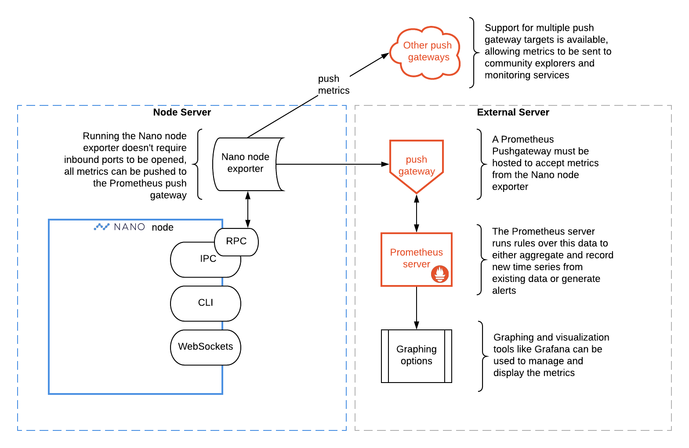

# Advanced Monitoring

For keeping a closer watch on node performance a Prometheus-based exporter monitoring solution is avialable. It provides an easy way to automatically gather and export a multitude of stats and metrics from the node RPC, as well as from the machine running the exporter. For added security, the exporter doesn't require opening any additional inbound ports as the metrics are pushed out to a Prometheus push gateway, which can be hosted externally.

Prometheus is an open-source systems monitoring and alerting toolkit. For a brief overview of everything it offers, see [What is Prometheus?](https://prometheus.io/docs/introduction/overview/)

!!! tip "Basic monitoring option"
	For a simpler monitoring setup that is maintained by the Nano community and provides a public website to view details on, see the [monitoring details on the Voting as a Representative page](voting-as-a-representative.md#setup-monitoring).

## Recommended architecture

The diagram below illustrates a recommended architecture of components:



This configuration was recommended as it splits the concerns across two servers: one hosting the node and exporter, with another hosting the push gateway, Prometheus server and graphing/visualization tools. However, there are a variety of configuration options to allow separation of each component onto different servers, depending on the needs.

## Installation

The following provides the basic details for installing and connecting the components outlined above.

### Step 1: Setup and configure Nano node

These configuration options are set in the [`config-node.toml` file](../running-a-node/configuration.md#configuration-file-locations).

* Get a [Nano node setup](node-setup.md) with Docker or binaries
* Update config `node.rpc.enable` = `true`
* If you want to gather [`nano_stats_objects*` metrics](https://github.com/nanocurrency/nano_prom_exporter#stats-exposed), update config `rpc.enable_control` = `true`
* Restart the node for settings to take effect

### Step 2: Install Prometheus push gateway

For the best security, it is recommended to run this on a separate server. By default this will need to accept incoming connections from the exporter on TCP port `9091`.

* Requires [python 3.7+](https://www.python.org/)
* Download and run the [prometheus-pushgateway](https://github.com/prometheus/pushgateway/blob/master/README.md#run-it)
* Accept incoming TCP port `9091` connections from the node/exporter server

### Step 3: Install and run the Nano node exporter

Typical configurations will have the exporter running on the same server as the node. If so, `--rpchost` is local as noted below.

**Install via pip**

`pip install nano-prom-exporter`

**Example run command**

```shell
nano-prom -h --rpchost ::1 \
             --rpcport 7076 \
             --datapath ~/Nano/Nano \
             --pushgateway your-exporter-and-node.server.org:9091 \
             --hostname MyNanoMetrics
```

See the [README](https://github.com/nanocurrency/nano_prom_exporter) for more details on usage.

### Step 4: View your metrics

To validate data is available from the exporter, the `/targets` endpoint on port `9090` at the URL of the push gateway will show job health: `http://your-new.monitor.org:9090/targets`. The endpoint pushing the data should have `State` = `UP` if everything is working well.

There is also a `/graph` endpoint to do some manual querying of available data: `http://your-new.monitor.org:9090/graph`

### Step 5: Install Grafana

Once you've verified metrics are properly being captured, you can setup visualization amd analysis solutions. One popular option is Grafana, which can be installed from here: https://grafana.com/grafana/download.

If Grafana is being installed on a different server from the Promethus push gateway TCP port `9090` will need to be opened as well.

Once running, a sample file can be used from our repository to kickstart your dashboard setup: https://github.com/nanocurrency/nano_prom_exporter/blob/master/sample-grafana-dashboard.json.

Other options can be explored in the [Visualization](https://prometheus.io/docs/visualization/browser/) section of the Prometheus site.

## Connecting to other push gateways

The exporter supports sending metrics to multiple push gateways using a `config.ini` file and the `--config_path` option in the command to accept the location.  Within this file the authentication can be managed between different endpoints and support for selecting specific metrics per push gateway will added soon. See the [README](https://github.com/nanocurrency/nano_prom_exporter) for more details on usage.

Although no public push gateways for node monitoring are available at this time, there may be opportunities in the future to share your node metrics with the community or other monitoring setups to provide a better view of network performance. Check back here and keep an eye out for these public gateways to become available.

And if you know of any public push gateways available to send this useful node data to, [please let us know](https://nano.org/connect).