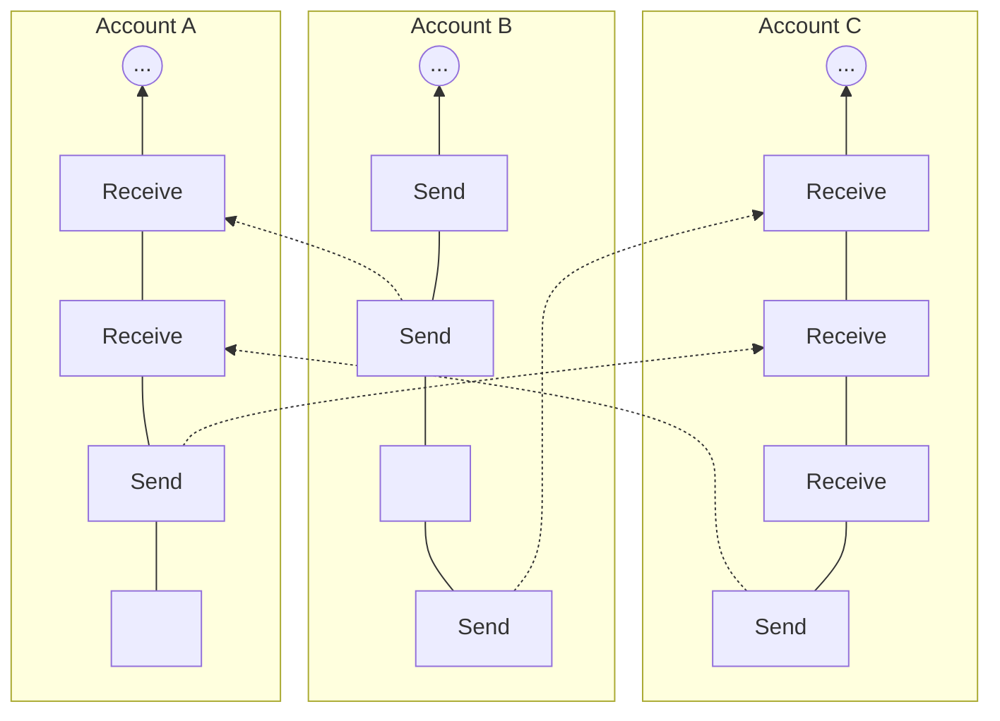
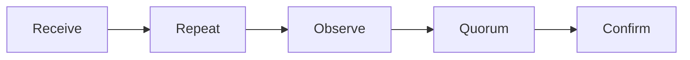
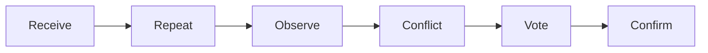
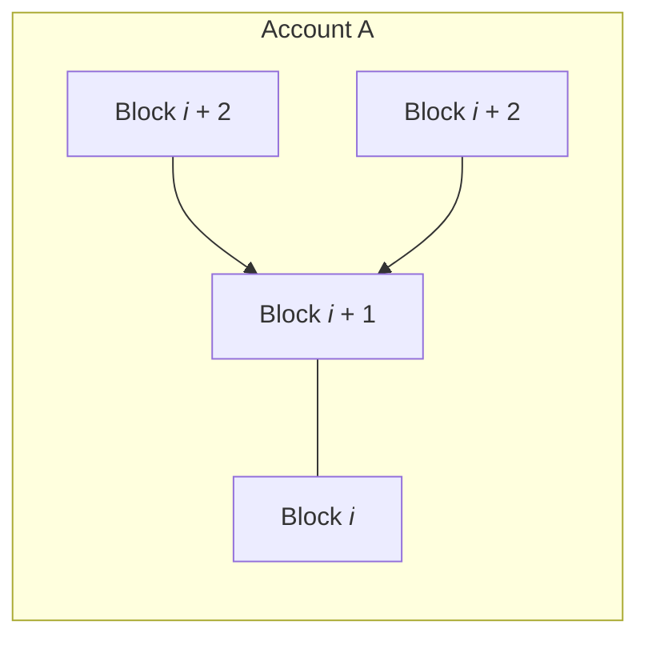

Title: Original RaiBlocks/Nano Whitepaper

# Original RaiBlocks/Nano Whitepaper

_Last updated: November 2017_

!!! info
    This original whitepaper contains details about the protocol which are no longer accurate, such as voting only being performed on blocks for which forks were detected, but is being left intact for historical reference purposes.

## Introduction

Since the implementation of Bitcoin in 2009, there has been a growing shift
away from traditional, government-backed currencies and financial
systems towards modern payments systems based on cryptography, which
offer the ability to store and transfer funds in a trustless and secure
manner [^1]. In order to function effectively, a
currency must be easily transferable, non-reversible, and have limited
or no fees. The increased transaction times, large fees, and
questionable network scalability have raised questions about the
practicality of Bitcoin as an everyday currency.

In this paper, we introduce RaiBlocks, a low-latency cryptocurrency
built on an innovative block-lattice data structure offering unlimited
scalability and no transaction fees. RaiBlocks by design is a simple
protocol with the sole purpose of being a high-performance
cryptocurrency. The RaiBlocks protocol can run on low-power hardware,
allowing it to be a practical, decentralized cryptocurrency for everyday
use.

Cryptocurrency statistics reported in this paper are accurate as of
publication date.

## Background

In 2008, an anonymous individual under the pseudonym Satoshi Nakamoto
published a whitepaper outlining the world's first decentralized
cryptocurrency, Bitcoin [^1]. A key innovation brought
about by Bitcoin was the blockchain, a public, immutable and
decentralized data-structure which is used as a ledger for the
currency's transactions. Unfortunately, as Bitcoin matured, several
issues in the protocol made Bitcoin prohibitive for many applications:

1.  Poor scalability: Each block in the blockchain can store a limited
    amount of data, which means the system can only process so many
    transactions per second, making spots in a block a commodity.
    Currently the median transaction fee is \$10.38 [^2].

2.  High latency: The average confirmation time is 164 minutes
    [^3].

3.  Power inefficient: The Bitcoin network consumes an estimated
    27.28TWh per year, using on average 260KWh per transaction
    [^4].

Bitcoin, and other cryptocurrencies, function by achieving consensus on
their global ledgers in order to verify legitimate transactions while
resisting malicious actors. Bitcoin achieves consensus via an economic
measure called Proof of Work (PoW). In a PoW system participants compete
to compute a number, called a *nonce*, such that the hash of the entire
block is in a target range. This valid range is inversely proportional
to the cumulative computation power of the entire Bitcoin network in
order to maintain a consistent average time taken to find a valid nonce.
The finder of a valid nonce is then allowed to add the block to the
blockchain; therefore, those who exhaust more computational resources to
compute a nonce play a greater role in the state of the blockchain. PoW
provides resistance against a Sybil attack, where an entity behaves as
multiple entities to gain additional power in a decentralized system,
and also greatly reduces race conditions that inherently exist while
accessing a global data-structure.

An alternative consensus protocol, Proof of Stake (PoS), was first
introduced by Peercoin in 2012 [^5]. In a PoS system,
participants vote with a weight equivalent to the amount of wealth they
possess in a given cryptocurrency. With this arrangement, those who have
a greater financial investment are given more power and are inherently
incentivized to maintain the honesty of the system or risk losing their
investment. PoS does away with the wasteful computation power
competition, only requiring light-weight software running on low power
hardware.

The original RaiBlocks paper and first beta implementation were
published in December, 2014, making it one of the first Directed Acyclic
Graph (DAG) based cryptocurrencies [^6]. Soon
after, other DAG cryptocurrencies began to develop, most notably
DagCoin/Byteball and IOTA [^7][^8]. These
DAG-based cryptocurrencies broke the blockchain mold, improving system
performance and security. Byteball achieves consensus by relying on a
"main-chain" comprised of honest, reputable and user-trusted
"witnesses", while IOTA achieves consensus via the cumulative PoW of
stacked transactions. RaiBlocks achieves consensus via a
balance-weighted vote on conflicting transactions. This consensus system
provides quicker, more deterministic transactions while still
maintaining a strong, decentralized system. RaiBlocks continues this
development and has positioned itself as one of the highest performing
cryptocurrencies.

## RaiBlocks Components

Before describing the overall RaiBlocks architecture, we define the
individual components that make up the system.

### Account

An account is the public-key portion of a digital signature key-pair.
The public-key, also referred to as the address, is shared with other
network participants while the private-key is kept secret. A digitally
signed packet of data ensures that the contents were approved by the
private-key holder. One user may control many accounts, but only one
public address may exist per account.

### Block/Transaction

The term "block" and "transaction" are often used interchangeably, where
a block contains a single transaction. Transaction specifically refers
to the action while block refers to the digital encoding of the
transaction. Transactions are signed by the private-key belonging to the
account on which the transaction is performed.

### Ledger

The ledger is the global set of accounts where each account has its own
transaction chain. This is a key design component that
falls under the category of replacing a run-time agreement with a
design-time agreement; everyone agrees via signature checking that only
an account owner can modify their own chain. This converts a seemingly
shared data-structure, a distributed ledger, in to a set of non-shared
ones.

``` mermaid
graph TB
    subgraph Account C
    A["Block <i>N<sub>C</sub></i>"]-->B["Block <i>N<sub>C</sub></i>  - 1"]
    B-->C["..."]
    C-->D["Block 1"]
    D-->E["Block 0"]
    end    
    subgraph Account B
    F["Block <i>N<sub>B</sub></i>"]-->G["Block <i>N<sub>B</sub></i>  - 1"]
    G-->H["..."]
    H-->I["Block 1"]
    I-->J["Block 0"]
    end
    subgraph Account A
    K["Block <i>N<sub>A</sub></i>"]-->L["Block <i>N<sub>A</sub></i> - 1"]
    L-->M["..."]
    M-->N["Block 1"]
    N-->O["Block 0"]
    end
```



### Node

A *node* is a piece of software running on a computer that conforms to
the RaiBlocks protocol and participates in the RaiBlocks network. The
software manages the ledger and any accounts the node may control, if
any. A node may either store the entire ledger or a pruned history
containing only the last few block of each account's blockchain. When
setting up a new node it is recommended to verify the entire history and
prune locally.

## System Overview

Unlike blockchains used in many other cryptocurrencies, RaiBlocks uses a
*block-lattice* structure. Each account has its own blockchain
(account-chain) equivalent to the account's transaction/balance history
Each account-chain can only be updated
by the account's owner; this allows each account-chain to be updated
immediately and asynchronously to the rest of the block-lattice,
resulting in quick transactions. RaiBlocks' protocol is extremely
light-weight; each transaction fits within the required minimum UDP
packet size for being transmitted over the internet. Hardware
requirements for nodes are also minimal, since nodes only have to record
and rebroadcast blocks for most transactions.



The system is initiated with a *genesis account* containing the *genesis
balance*. The genesis balance is a fixed quantity and can never be
increased. The genesis balance is divided and sent to other accounts via
send transactions registered on the genesis account-chain. The sum of
the balances of all accounts will never exceed the initial genesis
balance which gives the system an upper bound on quantity and no ability
to increase it.

This section will walk through how different types of transactions are
constructed and propagated throughout the network.

### Transactions

**Transaction Flow**



<p style="text-align: center; font-weight:bold;">(a) When no conflict is detected, no further overhead is required.</p>



<p style="text-align: center; font-weight:bold;">(b) In the event of a conflicting transaction, nodes vote for the valid transaction.</p>

Transferring funds from one account to another requires two
transactions: a *send* deducting the amount from the sender's balance
and a *receive* adding the amount to the receiving account's balance.

Transferring amounts as separate transactions in the sender's and
receiver's accounts serves a few important purposes:

1.  Sequencing incoming transfers that are inherently asynchronous.

2.  Keeping transactions small to fit in UDP packets.

3.  Facilitating ledger pruning by minimizing the data footprint.

4.  Isolating settled transactions from unsettled ones.

More than one account transferring to the same destination account is an
asynchronous operation; network latency and the sending accounts not
necessarily being in communication with each other means there is no
universally agreeable way to know which transaction happened first.
Since addition is associative, the order the inputs are sequenced does
not matter, and hence we simply need a global agreement. This is a key
design component that converts a run-time agreement in to a design-time
agreement. The receiving account has control over deciding which
transfer arrived first and is expressed by the signed order of the
incoming blocks.

If an account wants to make a large transfer that was received as a set
of many small transfers, we want to represent this in a way that fits
within a UDP packet. When a receiving account sequences input transfers,
it keeps a running total of its account balance so that at any time it
has the ability to transfer any amount with a fixed size transaction.
This differs from the input/output transaction model used by Bitcoin and
other cryptocurrencies.

Some nodes are uninterested in expending resources to store an account's
full transaction history; they are only interested in each account's
current balance. When an account makes a transaction, it encodes its
accumulated balance and these nodes only need to keep track of the
latest block, which allows them to discard historical data while
maintaining correctness.

Even with a focus on design-time agreements, there is a delay window
when validating transactions due to identifying and handling bad actors
in the network. Since agreements in RaiBlocks are reached quickly, on
the order of milliseconds to seconds, we can present the user with two
familiar categories of incoming transactions: settled and unsettled.
Settled transactions are transactions where an account has generated
receive blocks. Unsettled transactions have not yet been incorporated in
to the receiver's cumulative balance. This is a replacement for the more
complex and unfamiliar confirmations metric in other cryptocurrencies.

### Creating an Account

To create an account, you need to issue an *open* transaction.
An open transaction is always the first
transaction of every account-chain and can be created upon the first
receipt of funds. The *account* field stores the public-key (address)
derived from the private-key that is used for signing. The *source*
field contains the hash of the transaction that sent the funds. On
account creation, a representative must be chosen to vote on your
behalf; this can be changed later. The account can declare itself as its own
representative.

```
open {
   account: DC04354B1...AE8FA2661B2,
   source: DC1E2B3F7C...182A0E26B4A,
   representative: xrb_1anr...posrs,
   work: 0000000000000000,
   type: open,
   signature: 83B0...006433265C7B204
}
```

### Account Balance

The account balance is recorded within the ledger itself. Rather than
recording the amount of a transaction, verification requires checking the
difference between the balance at the send block and the balance of the
preceding block. The receiving account may then increment the previous
balance as measured into the final balance given in the new receive
block. This is done to improve processing speed when downloading high
volumes of blocks. When requesting account history, amounts are already
given.

### Sending From an Account

To send from an address, the address must already have an existing open
block, and therefore a balance. The *previous* field contains the hash of the
previous block in the account-chain. The *destination* field contains
the account for funds to be sent to. A send block is immutable once
confirmed. Once broadcasted to the network, funds are immediately
deducted from the balance of the sender's account and wait as *pending*
until the receiving party signs a block to accept these funds. Pending
funds should not be considered awaiting confirmation, as they are as
good as spent from the sender's account and the sender cannot revoke the
transaction.

```
send {
   previous: 1967EA355...F2F3E5BF801,
   balance: 010a8044a0...1d49289d88c,
   destination: xrb_3w...m37goeuufdp,
   work: 0000000000000000,
   type: send,
   signature: 83B0...006433265C7B204
}
```

### Receiving a Transaction

To complete a transaction, the recipient of sent funds must create a
receive block on their own account-chain. The source field references the hash of the
associated send transaction. Once this block is created and broadcasted,
the account's balance is updated and the funds have officially moved
into their account.

```
receive {
   previous: DC04354B1...AE8FA2661B2,
   source: DC1E2B3F7C6...182A0E26B4A,
   work: 0000000000000000,
   type: receive,
   signature: 83B0...006433265C7B204
}
```

### Assigning a Representative

Account holders having the ability to choose a representative to vote on
their behalf is a powerful decentralization tool that has no strong
analog in Proof of Work or Proof of Stake protocols. In conventional PoS
systems, the account owner's node must be running to participate in
voting. Continuously running a node is impractical for many users;
giving a representative the power to vote on an account's behalf relaxes
this requirement. Account holders have the ability to reassign consensus
to any account at any time. A *change* transaction changes the
representative of an account by subtracting the vote weight from the old
representative and adding the weight to the new representative. No funds are moved in this transaction, and
the representative does not have spending power of the account's funds.

```
change {
   previous: DC04354B1...AE8FA2661B2,
   representative: xrb_1anrz...posrs,
   work: 0000000000000000,
   type: change,
   signature: 83B0...006433265C7B204
}
```
### Forks and Voting

A fork occurs when $j$ signed blocks $b_1, b_2, \dots, b_j$ claim the
same block as their predecessor.



These blocks cause a conflicting view on the status of an account and
must be resolved. Only the account's owner has the ability to sign
blocks into their account-chain, so a fork must be the result of poor
programming or malicious intent (double-spend) by the account's owner.

Upon detection, a representative will create a vote referencing the
block $\hat{b}_i$ in its ledger and broadcast it to the network. The
weight of a node's vote, $w_i$, is the sum of the balances of all
accounts that have named it as its representative. The node will observe
incoming votes from the other $M$ online representatives and keep a
cumulative tally for 4 voting periods, 1 minute total, and confirm the
winning block.

$$\begin{aligned}
   v(b_j) &= \sum_{i=1}^M w_i{1}_{\hat{b}_i=b_j} \label{eq:weighted_vote} \\
   b^* &= \mathop{\mathrm{arg\,max}}_{b_j} v(b_j) \label{eq:most_votes}\end{aligned}$$

The most popular block $b^*$ will have the majority of the votes and
will be retained in the node's ledger. The block(s) that lose the vote are
discarded. If a representative replaces a block in its ledger, it will
create a new vote with a higher sequence number and broadcast the new
vote to the network. This is the **only** scenario where representatives
vote.

In some circumstances, brief network connectivity issues may cause a
broadcasted block to not be accepted by all peers. Any subsequent block
on this account will be ignored as invalid by peers that did not see the
initial broadcast. A rebroadcast of this block will be accepted by the
remaining peers and subsequent blocks will be retrieved automatically.
Even when a fork or missing block occurs, only the accounts referenced
in the transaction are affected; the rest of the network proceeds with
processing transactions for all other accounts.

### Proof of Work

All four transaction types have a work field that must be correctly
populated. The work field allows the transaction creator to compute a
nonce such that the hash of the nonce concatenated with the previous
field in receive/send/change transactions or the account field in an
open transaction is below a certain threshold value. Unlike Bitcoin, the
PoW in RaiBlocks is simply used as an anti-spam tool, similar to
Hashcash, and can be computed on the order of seconds [^9].
Once a transaction is sent, the PoW for the subsequent block can be
precomputed since the previous block field is known; this will make
transactions appear instantaneous to an end-user so long as the time
between transactions is greater than the time required to compute the
PoW.

### Transaction Verification

For a block to be considered valid, it must have the following
attributes:

1.  The block must not already be in the ledger (duplicate transaction).

2.  Must be signed by the account's owner.

3.  The previous block is the head block of the account-chain. If it
    exists but is not the head, it is a fork.

4.  The account must have an open block.

5.  The computed hash meets the PoW threshold requirement.

If it is a receive block, check if the source block hash is pending,
meaning it has not already been redeemed. If it is a send block, the
balance must be less than the previous balance.

## Attack Vectors

RaiBlocks, like all decentralized cryptocurrencies, may be attacked by
malicious parties for attempted financial gain or system demise. In this
section we outline a few possible attack scenarios, the consequences of
such an attack, and how RaiBlock's protocol takes preventative measures.

### Block Gap Synchronization

In a previous section, we discussed the scenario where a block may not
be properly broadcasted, causing the network to ignore subsequent
blocks. If a node observes a block that does not have the referenced
previous block, it has two options:

1.  Ignore the block as it might be a malicious garbage block.

2.  Request a resync with another node.

In the case of a resync, a TCP connection must be formed with a
bootstrapping node to facilitate the increased amount of traffic a
resync requires. However, if the block was actually a bad block, then
the resync was unnecessary and needlessly increased traffic on the
network. This is a Network Amplification Attack and results in a
denial-of-service.

To avoid unnecessary resyncing, nodes will wait until a certain
threshold of votes have been observed for a potentially malicious block
before initiating a connection to a bootstrap node to synchronize. If a
block doesn't receive enough votes it can be assumed to be junk data.

### Transaction Flooding

A malicious entity could send many unnecessary but valid transactions
between accounts under its control in an attempt to saturate the
network. With no transaction fees they are able to continue this attack
indefinitely. However, the PoW required for each transaction limits the
transaction rate the malicious entity could generate without
significantly investing in computational resources. Even under such an
attack in an attempt to inflate the ledger, nodes that are not full
historical nodes are able to prune old transactions from their chain;
this clamps the storage usage from this type of attack for almost all
users.

### Sybil Attack

An entity could create hundreds of RaiBlocks nodes on a single machine;
however, since the voting system is weighted based on account balance,
adding extra nodes in to the network will not gain an attacker extra
votes. Therefore there is no advantage to be gained via a Sybil attack.

### Penny-Spend Attack

A penny-spend attack is where an attacker spends infinitesimal
quantities to a large number of accounts in order to waste the storage
resources of nodes. Block publishing is rate-limited by the PoW, so this
limits the creation of accounts and transactions to a certain extent.
Nodes that are not full historical nodes can prune accounts below a
statistical metric where the account is most likely not a valid account.
Finally, RaiBlocks is tuned to use minimal permanent storage space, so
space required to store one additional account is proportional to the
size of an
$\text{open block} + \text{indexing} = 96\text{B} + 32\text{B} = 128\text{B}$.
This equates to 1GB being able to store 8 million penny-spend account.
If nodes wanted to prune more aggressively, they can calculate a
distribution based on access frequency and delegate infrequently used
accounts to slower storage.

### Precomputed PoW Attack

Since the owner of an account will be the only entity adding blocks to
the account-chain, sequential blocks can be computed, along with their
PoW, before being broadcasted to the network. Here the attacker
generates a myriad of sequential blocks, each of minimal value, over an
extended period of time. At a certain point, the attacker performs a
Denial of Service (DoS) by flooding the network with lots of valid
transactions, which other nodes will process and echo as quickly as
possible. This is an advanced version of the transaction flooding
described in the [Transaction flooding section](#transaction-flooding). Such an attack would only work
briefly, but could be used in conjunction with other attacks, such as a
\>50% Attack to increase effectiveness. Transaction
rate-limiting and other techniques are currently being investigated to
mitigate attacks.

### \>50% Attack

The metric of consensus for RaiBlocks is a balance weighted voting
system. If an attacker is able to gain over 50% of the voting strength,
they can cause the network to oscillate consensus rendering the system
broken. An attacker is able to lower the amount of balance they must
forfeit by preventing good nodes from voting through a network DoS.
RaiBlocks takes the following measures to prevent such an attack:

1.  The primary defense against this type of attack is voting-weight
    being tied to investment in the system. An account holder is
    inherently incentivized to maintain the honesty of the system to
    protect their investment. Attempting to flip the ledger would be
    destructive to the system as a whole which would destroy their
    investment.

2.  The cost of this attack is proportional to the market capitalization
    of RaiBlocks. In PoW systems, technology can be invented that gives
    disproportionate control compared to monetary investment and if the
    attack is successful, this technology could be repurposed after the
    attack is complete. With RaiBlocks the cost of attacking the system
    scales with the system itself and if an attack were to be successful
    the investment in the attack cannot be recovered.

3.  In order to maintain the maximum quorum of voters, the next line of
    defense is representative voting. Account holders who are unable to
    reliably participate in voting for connectivity reasons can name a
    representative who can vote with the weight of their balance.
    Maximizing the number and diversity of representatives increases
    network resiliency.

4.  Forks in RaiBlocks are never accidental, so nodes can make policy
    decisions on how to interact with forked blocks. The only time
    non-attacker accounts are vulnerable to block forks is if they
    receive a balance from an attacking account. Accounts wanting to be
    secure from block forks can wait a little or a lot longer before
    receiving from an account who generated forks or opt to never
    receive at all. Receivers could also generate separate accounts to
    use when receiving funds from dubious accounts in order to insulate
    other accounts.

5.  A final line of defense that has not yet been implemented is *block
    cementing*. RaiBlocks goes to great lengths to settle block forks
    quickly via voting. Nodes could be configured to cement blocks,
    which would prevent them from being rolled back after a certain
    period of time. The network is sufficiently secured through focusing
    on fast settling time to prevent ambiguous forks.

A more sophisticated version of a $>50\%$ attack is detailed below. "Offline" is the percentage of
representatives who have been named but are not online to vote. "Stake"
is the amount of investment the attacker is voting with. "Active" is
representatives that are online and voting according to the protocol. An
attacker can offset the amount of stake they must forfeit by knocking
other voters offline via a network DoS attack. If this attack can be
sustained, the representatives being attacked will become unsynchronized
and this is demonstrated by "Unsync." Finally, an attacker can gain a
short burst in relative voting strength by switching their Denial of
Service attack to a new set of representatives while the old set is
re-synchronizing their ledger, this is demonstrated by "Attack."

If an attacker is able to cause Stake \>Active by a combination of these
circumstances, they would be able to successfully flip votes on the
ledger at the expense of their stake. We can estimate how much this type
of attack could cost by examining the market cap of other systems. If we
estimate 33% of representatives are offline or attacked via DoS, an
attacker would need to purchase 33% of the market cap in order to attack
the system via voting.

### Bootstrap Poisoning

The longer an attacker is able to hold an old private-key with a
balance, the higher the probability that balances that existed at that
time will not have participating representatives because their balances
or representatives have transferred to newer accounts. This means if a
node is bootstrapped to an old representation of the network where the
attacker has a quorum of voting stake compared to representatives at
that point in time, they would be able to oscillate voting decisions to
that node. If this new user wanted to interact with anyone besides the
attacking node all of their transactions would be denied since they have
different head blocks. The net result is nodes can waste the time of new
nodes in the network by feeding them bad information. To prevent this,
nodes can be paired with an initial database of accounts and known-good
block heads; this is a replacement for downloading the database all the
way back to the genesis block. The closer the download is to being
current, the higher the probability of accurately defending against this
attack. In the end, this attack is probably no worse than feeding junk
data to nodes while bootstrapping, since they wouldn't be able to
transact with anyone who has a contemporary database.

## Implementation

Currently the reference implementation is implemented in C++ and has
been producing releases since 2014 on Github [^10].

### Design Features

The RaiBlocks implementation adheres to the architecture standard
outlined in this paper. Additional specifications are described here.

### Signing Algorithm

RaiBlocks uses a modified ED25519 elliptic curve algorithm with Blake2b
hashing for all digital signatures [^11]. ED25519 was
chosen for fast signing, fast verification, and high security.

### Hashing Algorithm

Since the hashing algorithm is only used to prevent network spam, the
algorithm choice is less important when compared to mining-based
cryptocurrencies. Our implementation uses Blake2b as a digest algorithm
against block contents [^12].

### Key Derivation Function

In the reference wallet, keys are encrypted by a password and the
password is fed through a key derivation function to protect against
ASIC cracking attempts. Presently Argon2 [^13] is the
winner of the only public competition aimed at creating a resilient key
derivation function.

### Block Interval

Since each account has its own blockchain, updates can be performed
asynchronous to the state of network. Therefore there are no block
intervals and transactions can be published instantly.

### UDP Message Protocol

Our system is designed to operate indefinitely using the minimum amount
of computing resources as possible. All messages in the system were
designed to be stateless and fit within a single UDP packet. This also
makes it easier for lite peers with intermittent connectivity to
participate in the network without reestablishing short-term TCP
connections. TCP is used only for new peers when they want to bootstrap
the block chains in a bulk fashion.

Nodes can be sure their transaction was received by the network by
observing transaction broadcast traffic from other nodes as it should
see several copies echoed back to itself.

### IPv6 and Multicast

Building on top of connection-less UDP allows future implementations to
use IPv6 multicast as a replacement for traditional transaction flooding
and vote broadcast. This will reduce network bandwidth consumption and
give more policy flexibility to nodes going forward.

### Performance

At the time of this writing, 4.2 million transactions have been
processed by the RaiBlocks network, yielding a blockchain size of 1.7GB.
Transaction times are measured on the order of seconds. A current
reference implementation operating on commodity SSDs can process over
10,000 transactions per second being primarily IO bound.

## Resource Usage

This is an overview of resources used by a RaiBlocks node. Additionally,
we go over ideas for reducing resource usage for specific use cases.
Reduced nodes are typically called light, pruned, or simplified payment
verification (SPV) nodes.

### Network

The amount of network activity depends on how much the network
contributes towards the health of a network.

**Representative**

A representative node requires maximum network resources as it observes
vote traffic from other representatives and publishes its own votes.

**Trustless**

A trustless node is similar to a representative node but is only an
observer, it doesn't contain a representative account private key and
does not publish votes of its own.

**Trusting**

A trusting node observes vote traffic from one representative it trusts
to correctly perform consensus. This cuts down on the amount of inbound
vote traffic from representatives going to this node.

**Light**

A light node is also a trusting node that only observes traffic for
accounts in which it is interested allowing minimal network usage.

**Bootstrap**

A bootstrap node serves up parts or all of the ledger for nodes that are
bringing themselves online. This is done over a TCP connection rather
than UDP since it involves a large amount of data that requires advanced
flow control.

### Disk Capacity

Depending on the user demands, different node configurations require
different storage requirements.

**Historical**

A node interested in keeping a full historical record of all
transactions will require the maximum amount of storage.

**Current**

Due to the design of keeping accumulated balances with blocks, nodes
only need to keep the latest or head blocks for each account in order to
participate in consensus. If a node is uninterested in keeping a full
history it can opt to keep only the head blocks.

**Light**

A light node keeps no local ledger data and only participates in the
network to observe activity on accounts in which it is interested or
optionally create new transactions with private keys it holds.

### CPU

**Transaction Generating**

A node interested in creating new transactions must produce a Proof of
Work nonce in order to pass RaiBlock's throttling mechanism. Computation
of various hardware is benchmarked in Appendix A.

**Representative**

A representative must verify signatures for blocks, votes, and also
produce its own signatures to participate in consensus. The amount of
CPU resources for a representative node is significantly less than
transaction generating and should work with any single CPU in a
contemporary computer.

**Observer**

An observer node doesn't generate its own votes. Since signature
generation overhead is minimal, the CPU requirements are almost
identical to running a representative node.

## Conclusion

In this paper we presented the framework for a trustless, feeless,
low-latency cryptocurrency that utilizes a novel block-lattice structure
and delegated Proof of Stake voting. The network requires minimal
resources, no high-power mining hardware, and can process high
transaction throughput. All of this is achieved by having individual
blockchains for each account, eliminating access issues and
inefficiencies of a global data-structure. We identified possible attack
vectors on the system and presented arguments on how RaiBlocks is
resistant to these forms of attacks.

-----

## Appendix A: PoW Hardware benchmarks

As mentioned previously, the PoW in RaiBlocks is to reduce network spam.
Our node implementation provides acceleration that can take advantage of
OpenCL compatible GPUs. Table I below provides a real-life benchmark
comparison of various hardware. Currently the PoW threshold is fixed,
but an adaptive threshold may be implemented as average computing power
progresses.

Table I  
Hardware PoW Performance

| Device                                     | Transactions Per Second |
|--------------------------------------------|-------------------------|
| Nvidia Tesla V100 (AWS)                    | 6.4 |
| Nvidia Tesla P100 (Google,Cloud)           | 4.9 |
| Nvidia Tesla K80 (Google,Cloud)            | 1.64 |
| AMD RX 470 OC                              | 1.59 |
| Nvidia GTX 1060 3GB                        | 1.25 |
| Intel Core i7 4790K AVX2                   | 0.33 |
| Intel Core i7 4790K,WebAssembly (Firefox)  | 0.14 |
| Google Cloud 4 vCores                      | 0.14-0.16 |
| ARM64 server 4 cores (Scaleway)            | 0.05-0.07 |

## Acknowledgment

We would like to thank Brian Pugh and B. Cchung for compiling and
formatting this paper.

## References

[^1]: S. Nakamoto, “Bitcoin: A peer-to-peer electronic cash system,” 2008. [Online]. Available: http://bitcoin.org/bitcoin.pdf
[^2]: “Bitcoin median transaction fee historical chart.” [Online]. Available: https://bitinfocharts.com/comparison/bitcoin-median-transaction-fee.html
[^3]: “Bitcoin average confirmation time.” [Online]. Available: https://blockchain.info/charts/avg-confirmation-time
[^4]: “Bitcoin energy consumption index.” [Online]. Available: https://digiconomist.net/bitcoin-energy-consumption
[^5]: S. King and S. Nadal, “Ppcoin: Peer-to-peer crypto-currency withproof-of-stake,” 2012. [Online]. Available: https://peercoin.net/assets/paper/peercoin-paper.pdf
[^6]: C. LeMahieu, “Raiblocks distributed ledger network,” 2014.
[^7]: Y. Ribero and D. Raissar, “Dagcoin whitepaper,” 2015.
[^8]: S. Popov, “The tangle,” 2016.
[^9]: A. Back, “Hashcash - a denial of service counter-measure,” 2002. [Online]. Available: http://www.hashcash.org/papers/hashcash.pdf
[^10]: C. LeMahieu, “Raiblocks,” 2014. [Online]. Available: https://github.com/clemahieu/raiblocks
[^11]: D. J. Bernstein, N. Duif, T. Lange, P. Shwabe, and B.-Y. Yang, “High-speed high-security signatures,” 2011. [Online]. Available: http://ed25519.cr.yp.to/ed25519-20110926.pdf
[^12]: J.-P. Aumasson, S. Neves, Z. Wilcox-O’Hearn, and C. Winnerlein, “Blake2: Simpler, smaller, fast as md5,” 2012. [Online]. Available: https://blake2.net/blake2.pdf
[^13]: A. Biryukov, D. Dinu, and D. Khovratovich, “Argon2: The memoryhard function for password hashing and other applications,” 2015. [Online]. Available: https://password-hashing.net/argon2-specs.pdf